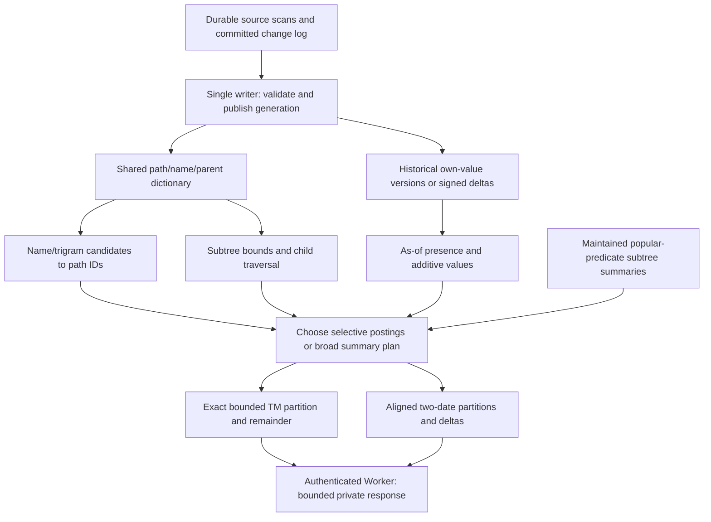

# Architectural alternatives: what has actually been tested

Evidence checkpoint: 2026-10-06. This compares the alternatives in [serving-options], [filter-query-service], [phase-0], [path-store], [path-store-search] and [ch-store]. “Measured” means the stated workload was run; “proposed” is not a performance result. Deployment status and release decisions belong in the architecture index, rather than being inferred from these experiments.

## The problem is aggregation, not just retrieval

A paged search can stop after finding enough matches for its first page. An exact treemap must account for every matching contribution, including the invisible remainder; a dTM must account for both dates and retain deleted or offsetting branches. Returning 100 attractive files out of 100M matches does not establish the other files' bytes or their distribution across directories.

This does not require sending 100M files to the browser. It requires an access path that can aggregate them without repeatedly expanding every file into all its ancestors. Trigrams help find candidate names; they do not automatically compute subtree sums, resolve historical presence or construct a useful bounded partition. This is why the earlier ClickHouse median of **0.20 s** is real but does not predict today's complete TM latency: it measured roots/totals, not rich rendering, ancestry and full response construction. [The measured workloads][serving-options] and [later complete-response results][ch-store] must remain separate.

## Comparison

| Architecture | Actual evidence | Historical TM/dTM tradeoff | Disposition |
| --- | --- | --- | --- |
| Worker + D1 footer + object-store parquet | Unified path/bysize sorts, cold footer tier, range merging and search sidecars implemented; original GCS bench had 71/105 flagged answers, median 6.9 s | Cheap, independently persisted snapshots; bounded decode and repeated network/string work constrain broad exact queries | Retain as front door and existing reader, not sole fleet-wide broad-search engine |
| Always-on custom RAM index | One 778M-node scan: 105/105 exact roots/totals; p50/p90/max 0.44/2.1/5.2 s | Fast ID-array traversal; independently loading two scans multiplies RAM, and all-history representation was not built | Promising baseline; historical delta version is proposed |
| Serverful DuckDB over locally cached parquet | Same 105 roots/totals exact; 2.0/12.1/91 s; 11.8 GB resident, 39.7 GB peak | Reuses files and SQL; broad names map into costly row-group decoding, sometimes full path scans | Useful ingestion/oracle tool; not winning serving plan |
| Disk-backed ClickHouse + RAM caches | Latest-scan roots/totals 0.20/1.46/4.33 s warm; append-only historical and numeric prototypes implemented separately | Multiple physical orders and historical compression; rich broad TM still has large aggregation tails | Main implementation direction, not yet general fast-FTS acceptance |
| Sparse predicate summaries on either RAM or disk | Frozen leaf `zarr.json` and `.npy` TM/dTM partitions validated; explicit directory-coverage mode also validated | Exact additive totals with bounded geometry; arbitrary Boolean/owner/age/rich fields and incremental maintenance missing | Strongest measured broad-query direction, narrower contract |
| Managed/serverless alternatives | Platform survey: Lambda/Cloud Run fan-out, Modal, Aurora/pg_trgm, BigQuery, ClickHouse Cloud, MotherDuck | Different cold-start, billing and ops choices; none removes aggregation or access-path requirements | Surveyed, not locally benchmarked alternatives |

The figures above are different contracts and machine/cache states, not a head-to-head production ranking.

## An always-on RAM-resident historical node

The proposal is **one shared identity/tree dictionary plus change rows**, not one full copy per scan. Keep durable source/checkpoints on disk or in the object store, replay committed changes into compact arrays, and build separate query access paths. The diagram is a proposed design, not the deployed service:

**Rows fitting is necessary, not sufficient.** The measured one-scan RAM index uses 40.4 GB of arrays: 127.35M original/lowercase names consume 13.2 GB; parent/name/count arrays 9.3 GB; bytes 6.2 GB; child ordering/offsets 6.2 GB; name-to-node arrays 3.6 GB; other arrays about 1.8 GB. Resident/peak RSS were 40.6/49.4 GB. Building it on 32 vCPU peaked at **175 GB**, and loading from GCS took 138 s. Two independent 41 GB generations do not fit a 64 GB node. These are measurements of the old snapshot implementation, not minimum requirements for a redesigned historical engine. [Evidence][filter-query-service].

For scale, canonical bookkeeping through 10-04 records **1,142,160,667 opened versions and 359,100,611 closures**, including the dirs-only epoch and complete 09-30 rebaseline. An *assumed*, deliberately slim 32–48 bytes/version is 36.5–54.8 GB; assumed 16-byte closures add 5.7 GB, and one 8-byte version-order/offset entry adds 9.1 GB. Reusing the old 13.2 GB vocabulary gives about **64.5–82.8 GB before additional dictionary/child indices, postings, summaries, allocator overhead, query intermediates or OS reserve**. This is envelope math, not measured RAM or a sizing recommendation. It also is not reconstructed full-object history: older canonical scans lack blobs. [Counts and coverage caveat][ch-store].

A RAM engine should therefore be evaluated with a concrete packed schema and the same complete TM/dTM oracle, measuring build peak and concurrent-query peak as well as loaded rows. Restart/replay, generation overlap during updates and a second serving replica need separate headroom. A “128 GiB node could fit” hypothesis would not establish that 128 GiB safely builds, updates and serves it. Storing durable history on SSD while pinning just dictionaries and hot summaries is a coherent intermediate design; all-history residency is optional, not an architectural prerequisite.

## Disk-backed indexed node: the current main direction

ClickHouse separates name discovery, name-to-node postings, subtree/path order and historical values. Initial seven-scan scalar history compressed to 569M object versions plus 218M directory versions, only 1.009/1.004 scan-equivalents. Its 0.1–0.5 s warm history probes were view-level/scalar aggregations; some filtered diffs still scanned hundreds of millions of rows rather than only changes. [Measured experiment][serving-options].

The subsequent append-only implementation avoids rewriting older partitions, but its 66-scan build occupied 96.1 GiB and the latest small-node ingest took 81.6 minutes excluding staged download. Those are a different schema/workload from the initial scalar benchmark. Full-fleet numeric two-date serving improves several complete bodies, while `config.json` regresses and rich historical `zarr.json` still takes 153 s cold. RAM caching alone cannot remove all that CPU/ancestor work. [Current evidence][ch-store].

SSD/NVMe helps local reads, sorts and spills; the current VM measurements used persistent **pd-ssd**, not local NVMe or HDD. Neither HDD latency nor a “large cheap disk” fleet serving configuration has been demonstrated. Keep bulk-build space, inactive parts and serving query memory separate from compressed table bytes. GCE suspend/resume was actually tested: the 41 GB RAM index took about 30 s to first exact answers after resume; it missed the proposed interactive wake-up gate. Always-on avoids that path. Historical pricing in the survey is not a current quote.

## Worker/parquet and DuckDB alternatives

The Worker work is substantial, not a discarded dead end: `bysize` pruning, range coalescing, name-major rows, exactness flags and parquet footer tiers improve ordinary views and selective search. On the R2 demo, name-major search reduced a complete `2019` query from 8.9–12.3 s to 1.9–2.0 s cold, while broad `parquet` remained partial. These are demo measurements, not billion-path GCS acceptance. [Search results][path-store-search].

Serverful DuckDB removes the isolate budget and remote-read overhead, but the full decoded path column was 95 GiB; a warm 16-thread path scan took 34–35 s. Names-first is much better, yet broad matches can still decode large row-group populations. This is an access-path issue, not evidence that SQL or parquet cannot scale. [Phase-0 evidence][phase-0].

Managed Postgres/trigrams, BigQuery, hosted ClickHouse, MotherDuck and function fan-out were researched in the survey, not measured substitutes. Moving to them would still require exact history and treemap aggregation acceptance; code-search-style first-page speed alone is insufficient. No current vendor prices or performance guarantees are asserted here.

## Directories, broad grams and what to test next

Directory aggregates do change when descendants change, but changes to one ancestor within a scan coalesce into one new version, not one version per leaf update. Upper levels are few; all directories are not negligible: the initial full scan had about 217M dirs and 561M objects. Measured ordinary directory churn was often lower than object churn; attribution re-slicing produced exceptional spikes. An O(changed leaves × depth) propagation upper bound is not the observed number of distinct changed directories. Separate hot-directory storage may help, but no result yet requires a separate history engine. [Churn evidence][path-store], [seven-scan counts][serving-options].

Own-object signed additive deltas can avoid treating every recursive dir rollup as a disjoint contribution; recursive rollups cannot simply be summed together. Max timestamps and other non-additive rich fields need different maintenance. Stable lineage bounds and bounded identity publication have passed component tests, not end-to-end incremental fleet serving. [Incremental gates][ch-store].

The sparse-query intuition is useful for **frequent expensive predicates**, not proof that all query combinations can be precomputed cheaply. `zarr.json`'s 68.4M postings compress into 92,096 sparse blocks; validated resident-summary views take 0.35–0.41 s, diffs 0.63–0.80 s. Conversely `.json` matches 55.93M vocabulary names: the live guard refuses that enumeration. Template normalization reduced 127.3M names to 2.16M shapes, but exact residual verification remains necessary. [Summary measurements][ch-store], [templates][phase-0].

Next gates should test maintained popular-predicate summaries and subtree-first queries, then complete correctness across dates and publication failures. Prepared Set membership and ordered aggregation were measured and rejected for worse pruning/latency; finer granules did not provide a decisive broad-query win. Limits should remain explicit refusals, not silent truncation. The aim is exact bounded aggregation, not rendering millions of cells and not declaring broad search fundamentally hopeless.

[serving-options]: ../serving-options.md
[filter-query-service]: ../done/filter-query-service.md
[phase-0]: ../done/filter-query-service-p0.md
[path-store]: ../path-store.md
[path-store-search]: ../path-store-search.md
[ch-store]: ../done/ch-store.md
