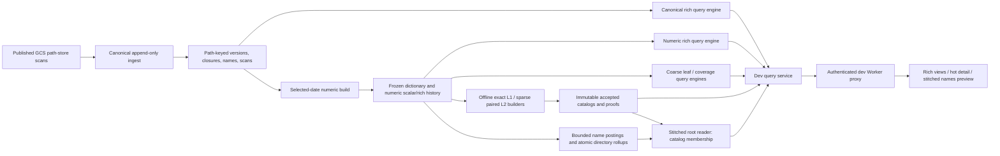
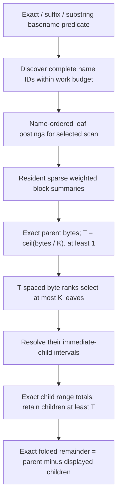
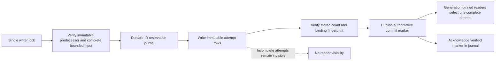

# ClickHouse indexing and serving designs

Status: **retired 2026-10-10.** The ClickHouse store, its VM and its code are gone (code at tag `ch-store-final`); this page records the designs that were tried.

As of 2026-10-07. This document separates the append-only historical store, the frozen numeric read model, the deployed dev-only aggregate catalogs, and incremental research. The detailed experiment journal and acceptance gates remain in [the ClickHouse spec][ch-spec] and [short-query plan][short-query]. Production still uses the serverless path-store architecture; none of the following constitutes a production cutover.

## Status and boundaries

| Design | Current status | Important boundary |
| --- | --- | --- |
| Path-keyed append-only history | Implemented; 67 canonical scans through 10-05 on the development VM | Indexed canonical scans before 09-30 are directories-only; retained object listings are not backfilled |
| Numeric scalar/rich history | Deployed on dev for the 10-04/10-05 full-fleet union | Frozen dictionary; other dates use canonical serving |
| Weighted leaf-range coarse reader | Backend experiment implemented, including bounded nested TM/dTM; former hosted `/coarse` page replaced by `/hot` | Different byte/count contract, not rich response parity |
| Directory-hit coverage reader | Backend experiment implemented, one level per drill; former hosted viewer replaced | Positive single literal; object counts, not matching-path counts |
| Subtree-first vocabulary bypass | Complete bounded real benchmark and native fixtures | Not deployed; session-owned index |
| Independent-dictionary coarse diff | Implemented research module; native exactness fixtures pass | Not routed, deployed or accepted against fleet snapshots |
| Threshold-hot name-substring L1 catalog | Accepted and live on dev: 71,182 T100k/L16 predicates on Oct 4/5 plus accepted Oct 6 root catalog; selected dated HTTP and registry bodies match pinned controls | Root/six-bucket byte/count summaries, not a whole-catalog source oracle; Oct 6 has no cold fallback/L2, and scheduled refresh/history are not integrated |
| Sparse paired bucket-child L2 catalog | Full 71,182-predicate v2/TCP artifact live on dev Pages `14c4c3bc`; 701,754 cells; all 427,092 whole HTTP diff bodies and post-copy Chrome checks pass | Fixed per-query/per-bucket K64 cutoff and exact Other; no deeper child drill or owner filters; not an independent full-catalog source oracle |
| Bounded name-summary seam / stitched reader | Live on dev Pages `b952334f`; six construction/control trials, timeout/admission/cleanup fixtures, 30 whole HTTP single/diff bodies and Chrome form switching pass | Frozen dates and root/bucket totals only for on-demand results; logical hit caps do not bound CH read amplification; still opt-in/default-off elsewhere |
| Stable identities, lineage and publication | Isolated geometry/history/journal/publication prototypes | No incremental fleet scalar/summary service |

The current development machine is eight vCPU, 32 GiB RAM and a 500 GiB persistent SSD disk. Source data and heavy processing stay on the GCS node; the laptop orchestrates source changes, small checks and browser verification. Detached node jobs survive an SSH disconnect, but do not keep laptop orchestration running during sleep. [Operations conventions][agents] describe source-sync and benchmark serialization. Pinned full-registry v2/TCP build `hot-l2-pair-all-04-05-b` completes without OOM in 3,368.125 seconds stream / 3,402.164 seconds build; artifact size is 211,480,689 bytes, not fleet usage or a serving-memory bound. Subset parity, all covered-control frames, four scoped source checks and 119 remote fixtures pass; `full_catalog_source_oracle:false` remains explicit. Full L2 activates at `07:42:11 UTC`. **All 427,092 whole diff responses pass**, exit 0/no OOM at `07:52:15 UTC`: 431.303 seconds excluding catalog load, same-node median/p90/max **0.726/0.807/11.306 ms**, largest body **12,606 bytes**, uncontrolled caches—not an edge SLA or independent source oracle. Approximate sampled backend RSS **1,807,636 KiB** is not a peak. Copy-only Pages `14c4c3bc` passes post-deploy Chrome paired-detail, exact-table, zero-result and baseline-preservation checks.

The bounded regular name/posting plan now passes six additional real seam trials on Oct 4/5: the unregistered directory-heavy case builds in **0.1295/0.13475 seconds**, with exact independent full-path controls; two near-T cases build in **0.6359/0.7938** and **1.68679/1.81816 seconds**, agreeing with accepted native catalogs. Nearly identical direct-hit cardinalities produce roughly **26.05M / 139.44M CH read rows** and **1.23 / 5.21GB query-log read bytes**: logical caps do not establish physical I/O or latency bounds. These are single uncontrolled-cache trials, not percentiles or a universal cutoff. **119 focused remote checks pass, including 19 native fixtures**, following 67 local passes with those fixtures initially skipped.

The stitched `/api/name-summary` + `/names` lane is accepted and live on dev Pages **`b952334f`**. It selects registered-hot catalog lookup or bounded cold work: **200K names / 100K postings / 100K outer roots**, **five-second combined-diff compute budget**, one cold/two hot slots, fail-fast admission and exact owned-query cleanup/quarantine. **138 remote fixtures pass in 6.01 seconds without skips**, including real deadline/KILL cleanup; **101 HTTP-checker fixtures pass in 2.95 seconds**. Thirty selected whole single/diff HTTP bodies agree with pinned catalog or independently accepted cold controls, except four validated timing values: cold median **124.244 / 237.300 ms**, hot median ranges **0.738–0.859 / 0.837–0.983 ms**, same-node/uncontrolled caches, not an edge SLA. The site passes **930 tests with one skip**, both type checks and build; Chrome verifies the actual form's plan switch and catalog-only prepared bucket links. On-demand results expose root/bucket totals only, not fake drill links. No immediate client-disconnect cancellation is claimed. Production, `/hot`, ordinary routes and daily refresh are unchanged; the new lane remains opt-in/default-off elsewhere. Detailed controls are in [the short-query plan][short-query].

## 1. Append-only historical store

The original implementation stores versions of `(depth,path,owner slice)`. A new or changed slice appends a full `nodes` row with opening scan `vf`. A vanished or changed slice appends a small `closures` record naming the old version and its closing scan `vt`; old node rows are not normally rewritten. The `changes` table contains signed ordinary day-to-day events, while `scans` advertises completed ingestion. This is an SCD-2-style interval model implemented with separate immutable opening and closing records, rather than mutations to each old row. [Schema][schema] and [ingestion][ingest] are authoritative.

An as-of read selects versions with `vf <= D` and excludes their closure keys with `vt <= D`. Path/name/parent restrictions are applied to both sides so a narrow query does not join all historical closures. A proven complete rebaseline supplies a lower epoch bound; a mere source-format change does not prove every path reopened. The store now runs through 10-06 and carries a consolidated name index over every scan; see [mega-index]. `by_name` and `by_parent` projections support search candidates and thresholded child walks; the lowercase-name vocabulary has a trigram text index.

The last ingest measured 81.6 minutes on this VM, excluding the already-staged source download. It published 129 bounded ranges with two ranges admitted concurrently. Query caps and explicit aggregation/join spilling avoided the earlier memory failure, but profiling still showed substantial aggregation spill work and approximately two query-accounted cores over the pairing wall time. This is not evidence that changing the disk alone solves ingestion, nor a production throughput target.

Directory changes do not automatically invalidate the design: measured histories compress many unchanged directories effectively. But directories are not guaranteed exponentially fewer than objects—unary/deep chains can make them numerous. A separate hot-directory representation remains a measured optimization question, not a prerequisite inferred solely from descendant updates.

## 2. Frozen numeric scalar and rich read models

The numeric experiment materializes selected canonical snapshots, unions their paths, assigns numeric identities, and computes contiguous DFS/preorder subtree intervals. The audited full-fleet union has 785,812,929 paths and 133,826,829 lowercase names; its snapshots contain 783,056,520 and 729,420,810 paths on 10-04/10-05. Nine full-domain checks validate identities, intervals, subtree endpoints and access-table counts. [Construction and audits][narrow] retain explicit completion checkpoints and bounded recovery.

The dictionary maps `(depth,path)` to numeric `id`, `pre`, `post` and name ID. Scalar records hold bytes/object counts; rich records hold owner maps, timestamps, storage-class totals and other canonical fields. Separate scalar and rich lifetimes are coalesced because their values change at different rates. Name-order and parent-order layouts support discovery and late metadata reads. Directory ancestor arrays support filtered synthesis.

These are frozen union IDs, not an incremental allocator. Inserting an arbitrary new path into dense preorder can shift old positions and invalidate stored interval summaries. Existing structural membership also does not establish that a path is present at a particular scan. The coalescer is an offline build over chosen snapshots, not daily append-only numeric ingestion.

The [numeric rich serving plan][narrow-serve] uses bounded joins, selected-root metadata reads, leaf intervals, visible intervals and folded-parent pruning. These complete-body comparisons are single independently cold trials at eight threads, not percentiles:

| Request | Numeric / canonical seconds |
| --- | ---: |
| TM `tensorstore`, 10-05 | 2.13 / 6.36 |
| TM `tomat`, 10-05 | 4.44 / 10.99 |
| TM `safetensors`, 10-05 | 4.64 / 8.83 |
| TM `config.json`, 10-05 | 10.80 / 5.96 |
| dTM `tensorstore`, 10-04 → 10-05 | 2.67 / 11.78 |
| dTM `safetensors`, 10-04 → 10-05 | 6.33 / 19.67 |

`config.json` regresses. Global rich historical `zarr.json` still takes 153 seconds versus 576 canonical; its scalar ancestor pass alone takes 98 seconds. Removing that pass would leave roughly 55 seconds, so the bottom-up experiment is parked. Earlier approximately 0.20-second results computed discovery/roots/totals, not the complete rich tree, ancestor work and response. The difference is principally the work contract, not proof that a search index stopped working.

Ordered aggregation reduced candidate memory but read nearly the whole fleet and regressed latency. Smaller rich granules reduced logical reads without proportional compression-block savings; they did not eliminate expensive ancestor construction. These experiments argue for changing broad-query work, not simply tuning index marks.

## 3. Aggregate-first coarse leaf serving

Millions of matches can contribute exactly without being reported individually. The [weighted range layer][ranges] builds sparse count/byte/object summaries for occupied 4,096-position blocks of leaf postings ordered by preorder. Packed cumulative arrays answer full-block portions in memory; bounded boundary reads recover exact partial-block totals. This does not cache the complete answers.

Every contiguous child whose byte total is at least `T` contains a selected rank. Thus discovery finds every drawable heavy child without grouping every matched path by all ancestors. Children below the threshold are folded into exact `(other)` byte/object/match totals. Zero-byte matches still count; they are not removed merely because no byte rank selects them. A truly flat directory may legitimately display mostly a remainder—no index creates absent hierarchy.

The [coarse reader][coarse] serves a separate contract: literal leaf-basename predicates, exact byte/count partitions, and explicit refusals for matching structural nonleaf nodes. Six independently cold `zarr.json` views over approximately 68.4M matches take 0.35–0.41 seconds; paired views take 0.63–0.80 seconds. Prefix summaries remain resident during those timings. Two-date construction/loading takes 1.47 seconds with uncontrolled build caches. The `.npy` substring covers 20.39M/19.66M paths; complete cold paired root/drill partitions take 0.93–1.41 seconds. These are not rich-TM speedups measured under equal response semantics.

Diff discovery runs on both dates, uses `ceil(max(before bytes,after bytes)/K)`, and retains a common union of at most `2K` heavy children. Counterpart totals are exact, including deleted/added branches and offsetting changes; selection by net delta would wrongly hide large unchanged or canceling branches. [Nested traversal][coarse-walk] refines disjoint frontiers at one global threshold rather than allocating K children independently to every branch. One level is default; levels 2–4 are bounded by a 2,048-path-node cap. A three-level `.npy` diff measured 3.561 seconds after shared-total reuse, with all 14 expanded partitions independently checked.

## 4. Matching-directory coverage and vocabulary limits

[Coverage][coverage] handles a positive single-literal full-path substring: a matching directory covers every descendant. Deduplicating nested matches yields disjoint outer roots. A view inside a covered root uses ordinary snapshot rollups; a containing view sums covered-root weights. Packed interval locators and cumulative weights support rank discovery without expanding descendants. Own objects at structural directory paths remain in the exact remainder.

The earlier dev coverage mode reports bytes and object counts, not matching-path counts, and supports one level per drill. The `datakit` paired root/covered-drill checks take 0.176/0.185 seconds with resident roots; a larger `checkpoint` cohort has 182,549 roots and complete paired checks around 0.21–0.28 seconds, with two-date construction approximately 1.65 seconds. Those figures do not establish Boolean, owner, age or rich-max semantics, nor current hot-catalog latency.

The earlier coarse/coverage guards include 500K vocabulary names, 20-second statements, 8 GiB query memory, four cached indexes and a 1 MiB private Worker response cap. Coverage additionally caps outer roots at 2M. Exceeding work budgets refuses, never silently truncates contributors. `.json` matches 55,930,370 distinct vocabulary names: that is not a per-scan file count. Repetition does not ensure sparse n-gram support; independent gram histograms also double-count overlaps and do not prove contiguous substring matches. These guards are not the artifact-only `/hot` serving contract.

A prepared Set-engine membership experiment regressed the cold `.npy` root from 0.697 to 4.783 seconds with large boundary scans. It is rejected and not enabled in serving.

The [subtree-first experiment][scoped] bypasses global vocabulary enumeration by directly filtering every basename in an accepted interval of at most 1M union nodes. A complete 50,993-node checkpoint scope returns four `.json` leaves; cold build/view take 0.1315/0.0947 seconds, with a separate complete oracle. This is a useful narrow-scope escape hatch, not global `.json` acceptance or a deployed fallback.

## 5. Independent snapshots: a nearer-term refresh path

The new [independent-dictionary leaf diff][coarse-pair] reuses each snapshot's quantile discovery, aligns only the bounded heavy child paths, and looks up each counterpart in its own dictionary. Added/deleted paths contribute zero on the absent side; numeric IDs are never borrowed across snapshots. Vocabulary bindings are restored before each source-consuming phase because independent snapshots can reuse a temporary table name while assigning different name IDs.

Its research schema is `coarse-pair-v1`, with snapshot-local IDs and nullable absent geometry. [Fixtures][pair-tests] deliberately use different preorders and complete independent path-scan oracles; the combined diff/admission/stream suite passes 53 native tests in 4.43 seconds. Server/date-manifest routing, generation-qualified caches and UI adaptation remain unimplemented. This removes the shared union rebuild correctness prerequisite for daily coarse diffs; it does not yet measure daily fleet construction cost or implement stable historical indexing.

The current daily **root-summary** prototype is narrower: reuse immutable T100k/L16 registry membership, independently build one new scan's scalar tree, then run the native registered-summary kernel. It does not rebuild rich history, global vocabulary or shared union positions. `daily_scalar` passes complete independent supplied-Parquet oracles at **27,754 and 792,961 nodes**, not an independent object-store inventory. The source/selection/dated-native gate passes **151 fixtures without skips**. The first full Oct 6 build completes upload/scalar reduction but fails its wide window sort at the 8-GiB query cap; a 1-GiB spill-threshold-only trial also fails. Four subsequent tiny native gates accept physical tree-sorted staging, serial in-order dense numbering and explicit real failed-build recovery. Full-fleet recovery then exits zero/no OOM at **12:42:06 UTC**, accepting all **606,128,524 scalar nodes** after **75m42s** without another source upload. The complete interval audit accounts for **42m34s**, the dominant measured refresh cost. Source rows and root weights equal cached published scan metadata, not an independent inventory oracle. Native root construction completes in **12m11s**, four independent full-source query controls pass in **7m39s**, and artifact-bound private publication passes. Dev **`8404e950`** enables this dated catalog after **239 backend fixtures / 42 complete HTTP responses** and real Chrome date/baseline/maps/table checks. `dated_hot_l1` retains original registry qualification and fresh source/date separately; no fresh Oct 6 frequency claim or cold fallback is inferred. A fused interval emitter subsequently reduces measured median audit duration **11.35%** on the complete 792,961-node subtree with byte-identical endpoints, not a fleet replay or projected SLA. New-date L2 and live cron remain unavailable; cleanup/retention policy is required before scheduled accumulation.

```mermaid
flowchart LR
    Q["Immutable registry<br/>qualification: Oct 4/5"] --> E["Explicit selection envelope<br/>membership ≠ fresh frequency"]
    P["Generation-pinned new scan<br/>v2 path-index parquet"] --> B["Date-local raw + scalar stages<br/>owner slices collapsed"]
    B --> T["Physical tree-key block sorts<br/>serial in-order numbering"]
    F["Failed raw/scalar-only attempt"] -. "Explicit source/query-log adoption" .-> T
    T --> A["Path / parent / rollup / interval audit<br/>completion marker last"]
    A --> E
    E --> N["Native substring activation<br/>exact root + bucket weights"]
    N --> D["Dated L1 artifact<br/>own source positions"]
    D --> C["Selected independent full-path controls<br/>not a full-catalog source oracle"]
    C --> G["Immutable accepted publication"]
    G --> R["Path-aligned dated root reader<br/>retain prior generation on failure"]
    R --> U["Dev dates + optional baseline<br/>Oct 6 root catalog only"]
```

Cross-date root diffs align stable bucket **paths**, not numeric preorder IDs. Reusing a registry on a new scan neither establishes the same predicate frequencies nor invents a new qualifying census. A complete global source is required for a daily artifact; bounded subtree benchmarks cannot be relabeled as global generations. The active fleet attempt measures disk/source coexistence, statement spill and Python interval-audit throughput; the supplied input alone is about 7 GiB. Daily cron hookup and backfill follow accepted publication, not these isolated fixture results.

## 6. Incremental research and publication boundary

[Lineage keys][order-keys] encode the root-to-node sequence of opaque immutable IDs. Subtree `K` occupies `[K,K[:-1] + [last_id+1])`; appending descendants preserves old keys/bounds. Alphabetical sibling order is unnecessary. A bounded real 100K-leaf geometry sample uses 1.73× scalar-only table bytes and passes exact sampled range sums, but proves neither complete FTS nor fleet storage/pruning costs.

[Signed own-leaf deltas][key-history] preserve additive historical bytes/object/presence counts across updates, deletion, resurrection and new descendants. They must not sum recursive directory rollups as disjoint data. Synthetic and complete bounded real scalar cohorts pass; non-additive maxima and maintained query summaries remain separate work.

The [reservation journal][reservations] uses a process writer lock and SQLite EXTRA synchronization; it allocates replay-stable bounded ranges, but is not reader visibility authority. [Identity publication][identity-publish] verifies immutable attempt rows before publishing ClickHouse markers and preserves old pinned reads. Native tests cover process death, partial writes, marker interruption and concurrent readers—not actual power loss or disk loss. A previously audited immutable baseline can remain in place with an append overlay; its declaration is not itself an audit/checksum.

The synthetic 100K identity screen publishes bootstrap bindings in 0.369 seconds, appends 100 in 0.153 seconds and retries without writes in 0.104 seconds. These exclude scalar/rich ingestion and billion-path lookups. End-to-end scalar/summary publication, new-scan refresh, concurrency tails, a durable service endpoint and reconstructed pre-09-30 object history remain production gates. No trillion-state query trie or universal subsecond guarantee is implied by these component results.

[ch-spec]: ../done/ch-store.md
[short-query]: short-query-index.md
[agents]: ../../AGENTS.md
[schema]: ../../cloud/src/dt_cloud/chstore/schema.py
[ingest]: ../../cloud/src/dt_cloud/chstore/ingest.py
[narrow]: ../../cloud/src/dt_cloud/chstore/narrow.py
[narrow-serve]: ../../cloud/src/dt_cloud/chstore/narrow_serve.py
[ranges]: ../../cloud/src/dt_cloud/chstore/range_bench.py
[coarse]: ../../cloud/src/dt_cloud/chstore/coarse.py
[coarse-walk]: ../../cloud/src/dt_cloud/chstore/coarse_walk.py
[coverage]: ../../cloud/src/dt_cloud/chstore/coverage.py
[scoped]: ../../cloud/src/dt_cloud/chstore/scoped_pattern.py
[coarse-pair]: ../../cloud/src/dt_cloud/chstore/coarse_pair.py
[pair-tests]: ../../cloud/tests/test_chcoarse_pair.py
[order-keys]: ../../cloud/src/dt_cloud/chstore/order_keys.py
[key-history]: ../../cloud/src/dt_cloud/chstore/key_history.py
[reservations]: ../../cloud/src/dt_cloud/chstore/reservations.py
[identity-publish]: ../../cloud/src/dt_cloud/chstore/identity_publish.py
[mega-index]: mega-index.md
