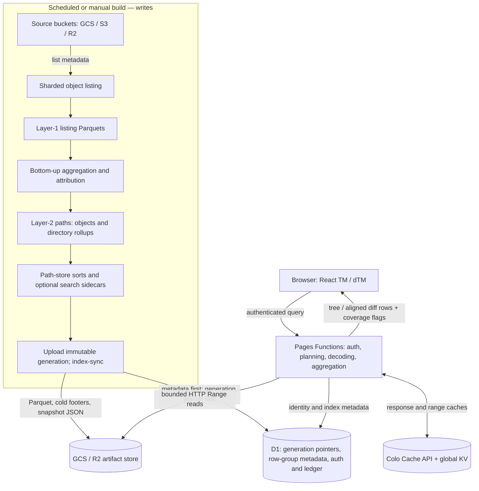

# Production serverless architecture

As of 2026-10-06. This describes the GCS production deployment, not the `ch-store` research worktree. Cloudflare deployment `873dfa7b` was verified by the coordinating agent to name source commit `3d0a4fa9637b978af6cad542767294352b527d84`, matching local `gcs-prod`. Source links below are pinned to that commit. ClickHouse and `/coarse` remain development experiments; neither is the production query engine described here.

## 1. Shape of the system

The serving system is a React site on Cloudflare Pages, Pages Functions running the query planner, immutable scan artifacts in object storage, D1 holding index pointers/row-group metadata and application state, and Cache API/KV layers avoiding repeated work. “Serverless” describes serving, not a requirement that scanning/building run inside a Worker: GCS listing and aggregation run as cloud batch jobs. Other deployments reuse the engine with S3/R2 inputs and an R2-backed artifact store. [Serving reader][index-source]



The diagram separates build writes from query reads. A treemap request does not list live buckets or rebuild a scan. It reads an already-published date/generation. Query handling can populate caches and authentication bookkeeping, but does not modify source objects, index contents or ownership assignments. Claims, staged-deletion plans and admin dispatch are separate mutation APIs; drawing a treemap never authorizes deletion.

## 2. Scanning, aggregation and publication

The generic engine’s `disk-tree bulk-list` shards an object listing into layer-1 Parquets. `disk-tree import` aggregates those objects bottom-up into layer-2 rows, optionally cutting path-store tiers. The cloud overlay can instead aggregate listings directly with `dt-cloud path-index`; `dt-cloud index-write` adapts imported layer-2 data. Objects have their own rows; directories carry recursive byte/object totals and structural fields. Attribution can produce multiple owner slices for the same path. [Path-store design][path-store]

The deployed GCS job fans listing work out across the fleet, refuses a missing completed bucket listing, and builds from archived listings. Its attribution-independent `dir-cache` permits re-attribution without rescanning every object. Finished sorts are built on local SSD before upload, rather than repeatedly sorting through GCS FUSE. The job publishes a new generation directory and separate snapshot JSONs consumed by the site. A page deployment is not required for each new scan. [GCS job][job-source]

The principal v2 sorts are `path-index.parquet`, ordered by depth/path, and `path-index-bysize.parquet`, ordered by descending logarithmic size bucket/path. User-led copies support estate queries. Legacy v1 scans instead have directory-only indexes, including size-floored coarse tiers. These are per-scan snapshots/read models, not an append-only path change-log. A changed high-level directory can therefore appear in each rebuilt scan even if most objects are unchanged.

Publication must keep bytes and metadata coherent: upload files that a generation will name, load its row-group metadata, then expose that generation through the D1 pointer. A reader pins its opened generation; a later pointer flip does not mix new metadata with old files. GCS footer retention defaults to the newest 30 scans; retired row-group metadata is served from cold footer sidecars without removing the scan’s pointer. [Index reader][index-source]

## 3. Why D1 does not hold the path database

`index_schema` identifies each date/variant’s generation, object-store directory, schema/version and floor. `index_row_groups` holds pruning statistics and compact Parquet group metadata keyed by generation. D1 selects candidate groups; it does not return every matched path or execute the full treemap aggregation.

Depth/path ordering makes a directory’s descendants at each depth a contiguous range. Group statistics prune by depth, prefix, size and, where applicable, owner. The Worker retrieves metadata only for selected groups, range-fetches their projected column spans, decompresses/decodes them with the JavaScript reader, and applies exact row predicates afterward. Adjacent spans are merged to reduce round trips; the deployed implementation limits merged range reads to six in flight. Coarse physical pruning is not exact selection: a surviving group may contain mostly irrelevant rows. [Index reader][index-source]

When D1 no longer retains a generation’s group rows, `<tier>.groups.parquet` is a small, separately prunable index over the tier’s footer metadata. Older generations without it can use `.groups.json`. Parsing the giant data file’s full footer on each cold Worker is deliberately avoided. The same reader supports GCS HMAC credentials and generic S3/R2 artifact credentials; GCS production’s artifacts live in GCS, not automatically R2 because the query runs on Cloudflare.

## 4. Authenticated request and cache path

```mermaid
sequenceDiagram
  participant B as Browser
  participant W as Pages Function
  participant D as D1
  participant C as Cache API / KV
  participant S as Artifact store
  B->>W: subtree(date, path, scope, viewport) or diff(from, to)
  W->>D: Authorize viewer; resolve generation and optional ledger head
  W->>C: Lookup versioned response key
  alt Response cached
    C-->>W: JSON
  else Cache miss
    W->>D: Select row groups for pinned generation
    opt Retired D1 group metadata
      W->>S: Range-read cold footer sidecar
    end
    W->>S: Fetch selected merged column ranges
    S-->>W: Parquet bytes
    W->>W: Decode, filter, aggregate, fold / align diff
    W->>C: Store response, optionally after returning via waitUntil
  end
  W-->>B: Private JSON response and coverage/timing metadata
  B->>B: Render TM / dTM; drill triggers another scoped request
```

`requireViewer` precedes cache lookup. Cache keys include scan generation, query syntax/text, path, dimensions/budget, scope and relevant ledger head; dimensions are quantized to improve reuse. The colo cache fronts a global KV response cache. Stored cache copies are shareable internally, but responses sent to clients are rewritten to private caching, so an internal cache hit does not bypass the viewer gate. This is distinct from range/decoded-group reuse inside the reader. [Subtree route][subtree-source], [cache implementation][cache-source]

## 5. TM, dTM and full-path search

An ordinary TM reads a root aggregate, derives a byte threshold from its bytes and viewport budget, and selects drawable descendants with depth attenuation. Remaining contributions can be represented as `(other)`, rather than fetching individual objects merely to draw invisible cells. Owner/class lenses alter the scoped aggregates. This is a bounded display, not a paginated file search.

The default filter language is case-insensitive full-path matching: substring terms, AND/OR, quoted literals, within-segment `*`, and global exclusions. Positive terms normally require three literal characters. A matching directory covers its descendants; outermost match roots avoid double-counting nested matches. Exclusions subtract covered subtrees from net aggregates. Regex/unindexable predicates can fall back to thresholded reads, explicitly marked approximate. [Search semantics][search-spec], [filter arithmetic][filter-source]

Search sidecars are optional per generation. Layout v2 stores name-major path/owner rows, trigram-to-name-ID postings, and a small directory locating both files’ row groups. The planner finds a sound candidate-name superset, verifies full-path predicates, lifts matches to their outermost roots, then reads the forest needed to construct the treemap. These sidecars use object-store ranges, not additional D1 path rows. The production job’s `PATH_INDEX_SEARCH` is opt-in; source supports the feature, but this document does not establish which live GCS generations actually contain sidecars. Missing sidecars invoke the documented approximate fallback. [Search reader][search-source], [GCS job][job-source]

A dTM reads two scans, computes a shared threshold, aligns named paths and looks up counterparts that crossed the threshold. `(other)` changes represent residual contributions on each side. This is not a direct temporal change-log query: both historical views must be constructed, potentially rereading one filtered side at the common threshold. Point lookups and output rows are bounded and report their caps. [Diff implementation][view-source]

Retained GCS source-history audits report directory-only v1 scans before 2026-09-30. Those scans can provide directory aggregates, not exhaustive historical blob-name FTS. The reader deliberately folds v2 objects when comparing against v1, rather than calling all newly represented objects “added.” Restoring older blob coverage requires full historical object sources and new indexes, not changing the query engine alone. This limitation comes from the audited sources, not a universal date rule hard-coded into serving. [History audit][ch-spec], [diff implementation][view-source]

## 6. Scale limits and operational interpretation

Trigrams reduce candidate discovery cost for selective queries, but a common term can still require huge name/posting sets and path decoding. A TM needs aggregate contributions across all matches, not just the first search-results page. The current index does not precompute arbitrary predicate-weighted subtree summaries; cheap discovery therefore does not imply cheap complete TM/dTM construction.

Production search imposes row-group, retained-row and staged wall-clock budgets: defaults include 256 v2 row groups, 50,000 kept rows and a 1.5-second search-stage budget. Exceeding them reports `partial` and reasons; overly broad trigrams are relaxed into wider candidate scans rather than unsoundly dropping candidates. The wall budget is checked between stages/range reads, not an end-to-end latency guarantee. Additional forest reads, decoding, aggregation, missing-side lookups and network latency follow. A 200 can therefore be partial or approximate, not proof of exhaustive FTS. [Search limits][search-source]

Caching makes repeated immutable queries cheap but cannot fix arbitrary cold-query fan-out. D1 reduces footer overhead but is not a billion-path search index. Multiple sort copies improve specific access patterns at storage/build cost. Daily snapshot construction and two-sided diff work remain proportional to substantial input, while flat directories or millions of similarly sized matches offer little useful leaf-level visual detail. ClickHouse research targets these limitations; its existence and component timings must not be described as production deployment or full historical acceptance.

[index-source]: https://github.com/Open-Athena/marin-gcs-usage/blob/3d0a4fa9637b978af6cad542767294352b527d84/site/functions/_lib/index.ts
[job-source]: https://github.com/Open-Athena/marin-gcs-usage/blob/3d0a4fa9637b978af6cad542767294352b527d84/job/run.sh
[subtree-source]: https://github.com/Open-Athena/marin-gcs-usage/blob/3d0a4fa9637b978af6cad542767294352b527d84/site/functions/api/subtree.ts
[cache-source]: https://github.com/Open-Athena/marin-gcs-usage/blob/3d0a4fa9637b978af6cad542767294352b527d84/site/functions/_lib/edgeCache.ts
[view-source]: https://github.com/Open-Athena/marin-gcs-usage/blob/3d0a4fa9637b978af6cad542767294352b527d84/site/functions/_lib/view.ts
[search-source]: https://github.com/Open-Athena/marin-gcs-usage/blob/3d0a4fa9637b978af6cad542767294352b527d84/site/functions/_lib/search.ts
[filter-source]: https://github.com/Open-Athena/marin-gcs-usage/blob/3d0a4fa9637b978af6cad542767294352b527d84/site/functions/_lib/filter.ts
[search-spec]: https://github.com/Open-Athena/marin-gcs-usage/blob/3d0a4fa9637b978af6cad542767294352b527d84/specs/path-store-search.md
[path-store]: ../path-store.md
[ch-spec]: ../done/ch-store.md
