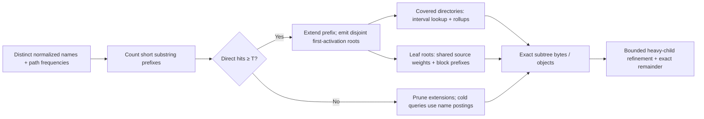
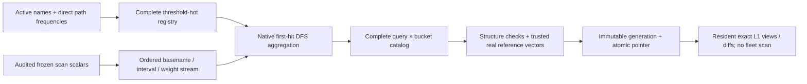
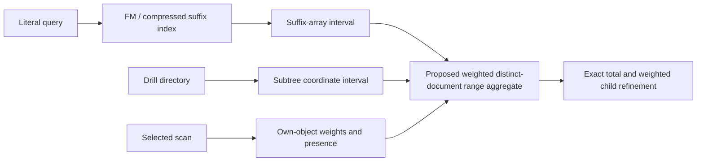

# Short-query aggregation: trie, suffix index and sizing gates

Evidence checkpoint: 2026-10-07. The target is an exact additive answer `F(query, subtree, scan)` over matching objects' own bytes/counts, followed by bounded heavy-child refinement. Queries are case-insensitive substrings within individual names: no slash characters or cross-segment matching. A matching directory name still covers its descendants. It is not a list of substring occurrences or a separate full fleet index for every query. Pages **`8404e950`** serves accepted Oct 6 registered root summaries alongside the full 71,182-predicate T100k/L16 Oct 4/5 L1/L2 catalogs and bounded old-date fallback. Oct 6 reuses registry membership, not its old frequency counts, and has no cold fallback or L2. All earlier 427,092 L2 bodies remain accepted; 42 new whole HTTP responses cover dated single/mixed views, registry metadata and unchanged old catalog/fallback results. Chrome verifies real paired maps/tables, optional-baseline URL/reload behavior and unavailable new-date refusal. The site passes **1,022 tests with one skip**, both type checks and preview build. These are catalog/HTTP and bounded browser checks, not independent full-catalog source truth or an edge SLA. Production, scheduled refresh, owner/Boolean and deeper child-drill contracts remain unchanged.

## Production contract and priorities

The Oct 6 reused-registry preview (`f07bc80b…`) was an incremental publication experiment; dev now serves Oct 6 from a superset catalog qualified per date by its own census (`438e6615…`, below). For each eligible scan and declared query-length domain, the logical hot registry must contain a literal if and only if its exact direct-name path count is at least that scan's threshold. Qualification must be derived from that scan, not inherited from another date. A physical answer cache may contain extra literals without making those literals logically threshold-hot. Comparison planning can use either side's hot answers and bounded evaluation for a cold side; it must retain each side's independent qualification. Queries outside the completed census's length domain are unclassified, not proven below threshold. A new scan cannot advertise complete bimodal coverage until both its qualification and cold serving path are accepted.

For a fixed path-name predicate and additive own-object contributions, filtering commutes with signed differencing: summing matching after-minus-before contributions gives the same net byte/object delta as subtracting the two matching snapshot totals. A changed-only treemap nevertheless omits unchanged matching mass, so its before/after areas and totals differ from the current complete-coverage comparison. Directory rollups and their descendant changes must not both be summed.

Text search with repeated directory drilling is a release requirement. Frozen Oct 4/5 bucket-root L2 is accepted; arbitrary-prefix weighted-range correctness is demonstrated only on bounded resident prototypes, not the whole fleet. The next acceptance gate must measure index construction/storage and exact scoped totals plus bounded heavy-child discovery under broad leaf and mixed-directory queries, including high-fanout directories. Bounded rendering alone does not prove bounded database reads. Do not describe the complete drilling product as production-ready from the root/bucket results.

Owner-plus-text compounds are deferred, not a release gate. The first text lane should explicitly disallow combined owner/text filtering. A later fallback may evaluate the cheaper side and post-filter only when it can materialize a complete bounded candidate set; a six-bucket aggregate is not such a set. Deadline or work-cap refusal must be specific and never approximate or partial. Report an exact match count only when actually known, label direct path hits versus covered objects correctly, and otherwise report a limit/lower bound rather than inventing a total.

Keep three artifacts distinct: the registry is literal qualification/frequencies; a root answer catalog additionally stores exact query-by-bucket byte/object summaries; the final scalar tree stores every path with subtree bounds and recursive weights. Root catalogs alone do not support arbitrary old-date drilling. The proposed seven-day local tree cache was an unapproved dev working-set policy, not a product retention requirement. Do not expire historical drill capability without an accepted queryable archive or replacement. Live cron hookup and cleanup remain separate, unauthorized operations; first establish fresh qualification and drilling, then choose retention.

## Active drill candidate: weighted quantile discovery

`coverage_quantiles.py` is a bounded correctness model, not a fleet index. A dated shared tree supplies prefix sums of own bytes/object counts in preorder. Each literal supplies disjoint first-hit coverage roots with cumulative weights; if an ancestor already matches, ordinary source subtree totals suffice. This gives exact matching totals for arbitrary subtrees without enumerating covered objects.

To find every immediate child with at least `tau` matching bytes, select matching byte ranks `tau, 2*tau, ..., floor(M/tau)*tau`, where `M` is the scope's exact matching byte total. Each child's contributions occupy one contiguous interval in matching-byte order; every interval of length at least `tau` contains a probe. Refine a probe inside a covered directory through the shared own-byte prefix to an actual contributing node, then follow its parent links to the scope's immediate child. Merely selecting the coverage-root directory would be incorrect when drilling inside it. Verify candidate weights exactly and subtract displayed children from the scope total to produce exact Other bytes/counts, including zero-byte objects and the scope's own objects.

For a paired view with display budget `K`, use the common integer threshold `tau = max(1, ceil(max(M_before, M_after)/K))`. Each date needs at most `K` probes; the path-aligned union has at most `2K` candidates. Each date resolves the same spelling in its own tree geometry. Three-level refinement can repeat this operation with bounded work at each displayed scope; the number of expanded scopes still needs a separate response/work budget.

The model has 24 tests, including an independent exhaustive own-contribution oracle, nested directory matches, absent counterpart paths, UInt64-scale threshold arithmetic, Unicode, zero-byte counts and repeated drilling. A 19,000-sibling fixture returns the exact partition using five probes and five candidate aggregates, with node iteration forbidden after index construction. The combined local census/quantile gate passes 123 tests with 17 native skips. These tests establish the algorithm's bounded candidate discovery, not physical storage/read cost. Construction is deliberately limited to 20K resident nodes; it scans all names per literal and retains Python source/locator data, so this implementation must not be used as a fleet builder.

The next drill gate is a disk-backed slice: build shared own-weight rank/select and path/parent lookup plus selected literal frontiers, then measure complete storage, peak memory, build time, cold/warm reads and repeated scoped partition latency against the oracle. Exercise `.npy`, `zarr.json`, directory-heavy matches and high-fanout scopes before a full-fleet storage trial. Reject partial construction or over-budget refinement explicitly. Frontier compression, total storage across all hot literals, daily updates and historical archive serving remain unmeasured.

Fresh qualification is a separate gate. `ch-hot-frequency-census -f SOURCE` accepts one canonical dated scalar-source manifest, stages basename-ordered rows, derives exact weighted name counts with in-order grouping, then uses the existing frequency-pruned substring census. It records the actual qualifying date and source binding, uses a nonrenewable deadline and owned-table cleanup, and checks staging space at boundaries (not an in-flight disk quota). Proposed first fleet trial is Oct 6 at `T=100000`, `L=16`, four threads, 8 GiB query memory, 16 GiB spill, 16 GiB staged tables, 20 GiB free-space reserve, 600 seconds per statement and 3,600 seconds total plus bounded cleanup. Native fixtures must establish complete export/oracle equality and actual temporary-table accounting before this trial. The Oct 6 trial has since run (see "Oct 6 own-census registry" below).

## Measured scale and envelope math

The frozen union has 133,826,829 distinct lowercase basename names containing 5,715,193,630 Unicode characters (5,727,266,492 UTF-8 bytes), or 42.706 characters/name. The full vocabulary aggregation takes 2.993 seconds at four threads with a 1 GiB query cap. It measures text volume, not distinct substring support. There are 25.900B occurrence windows of lengths 3–7 before per-name deduplication; storing one raw 12–16-byte name/pattern pair per window would require about 311–414 GB before sorting/build space, compression or path membership. This is an occurrence-window envelope, not an exact posting-size forecast. The measured volume excludes full-path ancestor and slash-crossing text.

The frozen hierarchy has six buckets, 3,461 paths immediately below the buckets (3,456 directories), and 263,697 at the next level (73,508 directories). Counting these rows takes 0.018 seconds. Suppose `Q` is the number of distinct stored patterns across the selected lengths. Dense UInt64 byte totals alone would cost:

| Assumed Q | Six bucket totals | Next-level totals across 3,461 paths | Further totals across 263,697 paths |
| --- | ---: | ---: | ---: |
| 10M | 0.48 GB | 276.88 GB | 21.10 TB |
| 100M | 4.8 GB | 2.77 TB | 210.96 TB |
| 1B | 48 GB | 27.69 TB | 2.11 PB |

These are decimal units, one scan, excluding pattern dictionary/index/offsets. Adding UInt64 object counts doubles the payload. Multiple dates multiply a naive snapshot cache; temporal coalescing/deltas may compress it but have build/update costs. Sparse nonzero entries can improve these envelopes considerably; sharing identical vectors or identical matching sets can improve them further. The table does not predict actual sparse size. Fixed shallow-root tables also do not answer arbitrary drill-directory queries.

Observed query support is not necessarily `alphabet_size^length`, but neither is it guaranteed small. Six hex characters have 16.78M possible values, seven have 268.44M. For an illustrative 40-symbol alphabet, the corresponding spaces are 4.096B and 163.84B. Numeric/hash tails can populate many patterns. Extending one fixed query cannot increase its matching set; summing the costs of *all* longer queries is a different question. Some long repeated strings also remain broad.

## A bounded census, not sampled answers

`ch-short-query-census` measures exact global name/character/window counts, then selects names by `cityHash64(nid) % modulus = 0`. For each length 1–7 it deduplicates repeated substrings within each name and measures distinct sample patterns and `(name,pattern)` pairs. It refuses more than 100K sampled names or a sampled name over 2,048 characters before substring expansion. Default query limits are four threads, 1 GiB and 30 seconds; all session state is cleaned up. It never treats the sample as an exact search result or extrapolates sample distinct counts as global counts.

The first nested hash sample (`modulus=8192`) contains 16,164 names. Five native tests pass in 0.70 seconds, including repeated occurrences, Unicode character boundaries and work-budget refusals. The real job takes 7.31 seconds, exits 0 without OOM, and reports 4.868 seconds inside the census:

| Length | Distinct sample patterns | Distinct sample name/pattern pairs |
| --- | ---: | ---: |
| 1 | 180 | 348,293 |
| 2 | 2,084 | 622,833 |
| 3 | 17,789 | 649,375 |
| 4 | 102,322 | 638,419 |
| 5 | 208,669 | 623,667 |
| 6 | 256,199 | 608,193 |
| 7 | 285,956 | 592,343 |

Those counts are lower bounds on global basename support, not global estimates. They omit substrings crossing `/` and repeated ancestor membership. The four-times-denser nested sample (`modulus=2048`) contains 65,082 names and 341 / 2,800 / 27,342 / 165,337 / 585,366 / 822,767 / 955,703 distinct patterns for lengths 1–7. Seven-character support increases 3.34× while sampled names increase 4.03×; the sample has not established global saturation. Its 2,386,411 distinct seven-character name/pattern pairs also show that occurrence deduplication and shared support are separate dimensions. The job finishes in 9.92 seconds, exits 0 without OOM, and reports 7.536 seconds inside the census. Relevant artifacts: `tmp/ch-store-short-query-{vocabulary-fixed,levels}.log`, `tmp/ch-store-query-census{.log,-state.json,-tests.log,-larger.log,-larger-state.json}`.

## The useful trie-like representation

A truncated generalized suffix trie/tree can represent observed substring queries out to seven characters, sharing prefixes and compacting unary paths. Interning states with identical matching sets or summary vectors can share payload as well. It should not attach a duplicated fleet index to each node.

A possible practical payload is an adaptive combination of small posting sets, disjoint matching-directory intervals, sparse weighted preorder blocks and shallow aggregate vectors. Materialize the expensive broad states; use exact posting evaluation when the complete result is cheap. Judge cost by vocabulary, path/posting and covered-root work, not just string length. The repeated nine-character `zarr.json` predicate is evidence that a strict seven-character materialization cutoff should be a first experiment, not a permanent planner rule.

Parent query aggregates cannot simply be obtained by summing child query aggregates: a file can contain both `aba` and `abb` and must contribute only once to `ab`. For full paths, adding recursive rollups for a matching ancestor and descendant likewise double-counts objects.

The prototype handles the latter through **first activation along a directory path**. Traverse the tree, tracking which short patterns are already present in its normalized ancestor names. Emit a pattern at a node only when it first becomes present on that branch; its directory rollup then covers the entire subtree. Only segment-local patterns activate. This produces disjoint outer coverage roots for each pattern; matching own objects and zero-byte object counts are preserved. It is the multi-pattern analogue of the existing single-pattern coverage deduplication. External ancestor-name matches use the scope's ordinary rollup, even when that pattern has no direct hits inside the scope.

## Frequency-threshold prototype

`ch-hot-name-bench` reads one complete frozen subtree of at most 20K union nodes and builds short-query payloads only when at least `T` paths directly match the name substring. Repeated occurrences in one name count once; repeated names at different paths count separately. This threshold counts direct name matches, not object bytes or inherited descendant coverage. A cheap directory predicate may have few direct hits but cover many objects. Below-threshold queries use matching-name postings reduced once per query, with temporary exact prefix sums; they do not repeatedly scan own contributions for each displayed child.

Construction prunes the query trie: only extensions of hot prefixes are counted. If a prefix has fewer than `T` direct hits, every longer extension does too, so pruning is exact. This avoids storing or expanding a dense set of rare long hash/UUID fragments. It does not guarantee small payloads for common short fragments. Counts are weighted by each distinct name's path frequency, not by the number of unique names. The prototype retains packed disjoint-root interval/prefix-sum arrays and interns identical coverage sets. It returns up to three levels using a fixed byte threshold and exact byte/object remainders. At each drill, the threshold is recomputed for that scope. This is bounded resident-subtree refinement; scanning immediate children here does not establish an efficient billion-path heavy-child access method.

`T` is a materialization policy, not yet a worst-case latency guarantee. Below-threshold posting evaluation can be bounded by hit count only after matching-name discovery is efficient and scope/date membership is resolved. The current bounded prototype enumerates its resident distinct names; it does not solve fleet-wide rare-short-query discovery. Conversely, above-threshold exact aggregates can still be expensive to refine if discovering heavy children requires a wide sibling scan. The planner needs separate discovery, postings, aggregate and refinement budgets.

A practical fleet milestone can deliberately materialize only exact L1 bucket totals for expensive predicates, then add L2/L3 tiles where storage/build/refinement budgets allow. “Degraded” should mean less displayed depth, not approximate bytes or silently truncated contributions. That is a different payload choice from the arbitrary-subtree prefix/block prototype measured below: a six-bucket vector can be much smaller, but does not automatically support arbitrary-directory drilling. A planner should expose its exact resolution and scan coverage and refuse unavailable refinement explicitly. `T`, payload representation and depth budgets are separate tuning knobs.



For intuition only, with independent uniform 32-character hex names, a fixed `k`-character fragment has about `(33-k)/16^k` occurrence windows per name, before overlap/deduplication corrections. At one billion such names, a seven-character fragment has about 97 expected occurrences, a six-character fragment about 1,609, and a four-character fragment about 442K. Thus `T=1000` would not automatically prevent a dense rollout of the 16.78M possible six-character states in that hypothetical fleet. `T` needs fleet-scale tuning plus explicit pattern/payload/build caps; it cannot guarantee sparse support merely because names are hashes. Pruning rare long branches is useful, but many shorter hex queries can still be genuinely broad. This is a synthetic distribution assumption, not a fleet measurement or a probability guarantee for nonrandom names.

Work caps are 20K input nodes, 2M candidate name/pattern pairs, 2M coverage-root records and seven query characters. Excess refuses rather than returning a partial index. The reported packed bytes exclude Python objects, query dictionary, source nodes and construction state. The process RSS measurement includes those overheads. Thresholds in this experiment are local to the complete subtree, not fleet frequency estimates. The own-contribution oracle is independent of gram enumeration and root reduction, but derives own weights from snapshot rollups; it is not independent raw-listing ground truth.

The first complete real scope has 7,584 paths. At `T=10/100/1000`, hot patterns are `4,545/272/16`, candidate patterns counted are `68,965/4,388/289`, and packed payload bytes are `14,266,320/6,918,768/424,624`. Builds take `1.430/0.754/0.326` seconds, with 265.7 MB peak process RSS across all three runs. Job exit is 0, no OOM. The first latency run exposed repeated cold-subtree scans for a directory-name query; that route was replaced before further acceptance. Exact totals passed, but those initial cold timings are not the optimized result. Artifacts: `tmp/ch-store-hot-name-step{.log,-state.json}`.

`ch-hot-name-hash-bench` generates a complete three-level deterministic hash-heavy synthetic tree, with hash names plus a common `.npy` suffix. It separates hash-branch growth from the real checkpoint subtree's name distribution. Neither experiment estimates whole-fleet storage by linear extrapolation.

The corrected real run finishes in 5.92 seconds including loading, three index builds, repeated views and oracle checks. For `T=10/100`, `00` has 817 direct hits and returns a three-level 31-node partition in 12.1 ms (median of five resident calls). At `T=1000` it uses cold postings and returns the same partition in 13.3 ms. A one-hit directory-name predicate improves from the initial repeated-scan route's 2.3 seconds to 3.1–3.4 ms. Zero direct local hits can still have full ancestor-name coverage. Load takes 0.081 seconds and process RSS peaks at 267.6 MB. These timings exclude HTTP, cold storage and fleet discovery.

The synthetic tree has 8,329 nodes and 8,192 hash-named leaves. At `T=10/100/1000`, hot patterns are `5,828/366/32`, candidate patterns counted are `75,674/4,789/413`, and packed payload bytes are `19,021,296/10,747,536/3,063,712`. Builds take `2.020/1.272/0.661` seconds and process RSS peaks at 300.8 MB. `.npy` matches all 8,192 leaves and its exact root view takes 0.31–0.34 ms; `abc` matches 58 paths and switches from hot to cold between thresholds 10 and 100, with unchanged exact output. All partitions match the own-contribution oracle; both jobs exit 0 without OOM. Flat similarly-sized leaves remain in an exact remainder when below the display threshold, rather than forcing a large rendering. Artifacts: `tmp/ch-store-hot-name-step-b{.log,-state.json}`, `tmp/ch-store-hot-name-hash{.log,-state.json}`. A follow-up explicitly measures drilling and more compact leaf payloads.

### Compact leaf-payload comparison

`hot_names_blocked.py` retains UInt32 source-node ordinals for leaf postings and cumulative byte/object totals every 64 postings, rather than a UInt64 start/end/full weighted prefix for every leaf. Boundary sums read at most 126 source leaf weights per aggregate query; aligned blocks need none. Nonleaf coverage roots retain the interval payload. The source preorder lookup is shared, and reported query payload bytes exclude the common immutable source geometry/scalars. The factory verifies that every coverage root has the same interval and weights as its source node. This reduces query payload storage, not the cost of storing/accessing source weights.

| Corpus | T | Full root payload bytes | Blocked payload bytes |
| --- | ---: | ---: | ---: |
| Real 7,584-path subtree | 10 | 14,266,320 | 1,979,004 |
| Real 7,584-path subtree | 100 | 6,918,768 | 924,064 |
| Real 7,584-path subtree | 1,000 | 424,624 | 56,492 |
| Synthetic 8,329-node hash tree | 10 | 19,021,296 | 2,648,984 |
| Synthetic 8,329-node hash tree | 100 | 10,747,536 | 1,447,544 |
| Synthetic 8,329-node hash tree | 1,000 | 3,063,712 | 417,344 |

All root and drill partitions are byte-identical between representations and pass the independent own-contribution oracle. For the real `00` hot query, root and drill views take about 12 ms with full prefixes versus 37.5 ms blocked. The synthetic all-leaf `.npy` root is about 0.32 ms full versus 0.90 ms blocked; drilling into one region refines 17 exact nodes in about 0.9 ms full versus 5.5–5.9 ms blocked. These are resident-process timings, not fleet/HTTP or cold-I/O guarantees. Maximum process RSS is 265.0/301.7 MB for real/hash runs and includes both representations simultaneously. Jobs finish in 25.52/32.67 seconds, exit 0 without OOM. Initial blocked conversion repeatedly validates the whole common source per unique payload, costing 17.7/22.6 seconds at `T=10`; a shared validated builder is the next implementation fix, not an inherent required cost. Seventy-seven focused tests pass, including all hot patterns across every node in a complete 130-leaf fixture and a structural assertion excluding hidden per-leaf weighted-prefix arrays. Artifacts: `tmp/ch-store-hot-name-{step,hash}-blocked{.log,-state.json}`, `tmp/ch-hot-name-combined-tests.log`.

The shared `BlockedBuilder` now validates the common source once and keeps all per-root correspondence/overlap checks; 78 focused tests pass, including instrumentation proving one source validation across multiple packs. All payloads share one preorder view, and the caller must keep its source unchanged for their lifetime. A second real corpus, a complete 22-node Datakit/Zarr part containing a nested temporary hash-named directory, verifies `zarr.`, `input`, `tmp` and a hash fragment across thresholds 1/3/10. Exact root/drill outputs remain unchanged when predicates switch to cold postings. This small corpus tests different coverage semantics, not scaling or a representative name distribution. Its job exits 0 without OOM in 2.49 seconds. In directory-only tiny payloads, blocking can be larger (48 versus 64 bytes), so a final planner should choose representation by cost rather than blindly blocking every pattern. Artifact: `tmp/ch-store-hot-name-datakit-blocked{.log,-state.json}`.

`ch-name-frequency-census` adds a read-only, exact snapshot basename-reuse histogram using the `(nid,pre)` order of `nodes_by_name`. It reports names and paths above several thresholds without expanding substrings or writing an index. This is not the hot-substring distribution: many individually rare names can all contain a common suffix. Native fixtures check separate snapshots, inclusive threshold boundaries, repeated/unsorted thresholds and unchanged table contents before a full-snapshot screen. Query limits are four threads, 1 GiB and 30 seconds; excess throws.

The full 10-05 snapshot screen succeeds in 15.008 seconds, exits 0 without OOM in 17.37 seconds, and writes no index. It has 729,420,810 present paths and 123,692,932 distinct active basename IDs; these differ from the two-date union's larger cardinalities. The most reused basename appears at 68,813,438 paths. Counts above thresholds are:

| Minimum exact-name reuse | Names | Paths using those names |
| --- | ---: | ---: |
| 10 | 6,584,077 | 574,462,294 |
| 100 | 305,299 | 498,960,356 |
| 1,000 | 6,797 | 452,134,799 |
| 10,000 | 2,150 | 440,179,883 |
| 100,000 | 178 | 383,794,671 |
| 1,000,000 | 9 | 344,217,689 |

These are exact-name frequencies, not bounds on the number of hot substring states. `ch-pattern-frequency-census` next merges ordered snapshot name frequencies with the union name text to measure exact direct-hit counts for selected short patterns, without collecting millions of matching name IDs in Python. It uses the same time/memory caps plus a 1-GiB temporary-disk cap. This still does not compute inherited coverage bytes, build a global trie, or prove query latency. Artifacts: `tmp/ch-store-hot-name-fleet-frequency{.log,-state.json}`.

The initial selected-pattern fleet merge fails with query memory-limit error 241 in a 3.01-second job, not a VM/container OOM. No partial counts are accepted and limits are not raised. Local source confirms that `names` is ordered by text `l`, not `nid`, whereas `nodes_by_name` is ordered by `(nid,pre)`. Thus the name text requires sorting for a name-ID merge; claiming both sources were already physically name-ID ordered would be incorrect. [ClickHouse's join guidance][ch-joins] explains that physical join-key ordering permits skipping sort and lowers merge-join memory. The retry computes a UInt16 selected-pattern match mask before sorting, so the join carries only `(nid,mask)` rather than basename text, disables join-side swapping/key-set preprocessing, and keeps all caps unchanged. This is a bounded discovery experiment, not a reason to accept a more memory-intensive serving plan. Artifacts: `tmp/ch-store-hot-name-fleet-patterns{.log,-state.json}`.

That numeric-mask retry also fails with error 241 at the unchanged 1-GiB cap in a 5.83-second job, without container/VM OOM. No fleet substring counts are accepted. Ten native fixture tests pass in 0.71 seconds with the vocabulary physically sorted by `l` as in the real layout; small-fixture correctness is not memory-scale acceptance. The lexical/name-ID order mismatch is real, but the memory exception alone does not identify the dominant retained buffer. Save `EXPLAIN PIPELINE` and query-log allocation/sort events before choosing a fix. The next discovery-layout gate is a properly bounded name-ID-ordered projection or explicitly staged/chunked numeric masks/frequencies, not repeated unbounded joins or a larger serving memory budget. This gate remains separate from the successful local hot-aggregate tests. Artifacts: `tmp/ch-store-hot-name-fleet-pattern-mask{.log,-state.json}`, `tmp/ch-store-pattern-mask-lexorder-tests.log`, `tmp/ch-store-hot-name-mask-plan.log`.

The diagnostic pipeline has sorting stages on **both** join sides, even though the frequency aggregation starts with in-order reads. Its right side includes `FinishAggregatingInOrderTransform`, then `MergingAggregatedBucketTransform`, then partial/merge sorting before `MergeJoinTransform`. Thus enabling in-order aggregation does not establish a streaming sorted join in this plan. Query-log exception data reports 3.342 seconds, 202,540,695 rows / 7,302,233,194 bytes read and 1,071,742,194 bytes tracked memory; no sort/aggregation-labelled profile events are recorded in that failed event. This narrows the layout/pipeline investigation but is not a processor allocation attribution. Runtime table metadata also reports `nodes_by_name` as a view rather than a directly sorted table, so its underlying source ordering must be inspected rather than inferred from the initial construction code. The read-only cleanup check reports zero active census queries. No more data-scan retries are launched for this screen.

`SHOW CREATE`-equivalent catalog metadata confirms that the live 10-05 `nodes_by_name` view filters `nodes_history_by_name` by `vf <= selected_date < vt`; it is not the initial separate physical snapshot table. The successful basename-frequency screen and failed merge therefore run over the frozen history-backed view with date filtering. A staged discovery read-model must preserve that as-of membership, not count union IDs as present paths. The layout dump is retained in `tmp/ch-store-hot-name-layout.log`.

### Offline-budget correction and completed fleet census

The 1-GiB/30-second screen was an arbitrary cheap-feasibility probe, not a requirement for this one-off fleet census or a ClickHouse limit. Treating its failure as an architectural blocker was incorrect. The existing 32-GiB dev node has about 28 GB available memory and 89 GB free disk at the resumed check; the offline census now exposes separate memory, deadline and spill budgets, with no changes to live-serving limits. Default offline limits are 8 GiB, 180 seconds and 8 GiB temporary disk. Queries receive unique IDs for memory/I/O profiles and optional same-host RSS samples. Twenty-three mocked tests verify exact defaults/overrides, CLI forwarding, cleanup and no hidden SQL-level 1-GiB spill override.

The sequential 2/4/8-GiB trials use the same eight patterns, four threads, a 180-second deadline and 8-GiB spill allowance. Cache state is uncontrolled. The 2-GiB run fails at aggregation with error 241 after an 18.88-second job; sampled simultaneous ClickHouse/service RSS peaks at 5.606 GB. The 4-GiB run succeeds in 31.427 seconds with 2,612,044,394 bytes tracked peak query memory and 5,882,650,624 bytes sampled simultaneous RSS. The 8-GiB repeat succeeds in 30.459 seconds with 2,346,280,500 bytes tracked peak and 5,734,252,544 bytes sampled simultaneous RSS. Both exact result vectors are equal and cover all 729,420,810 present paths / 123,692,932 active names. These are offline collection timings, not serving latency or controlled performance percentiles.

| Selected substring | Active matching names | Direct matching paths |
| --- | ---: | ---: |
| `.json` | 46,101,300 | 209,831,634 |
| `.npy` | 209,402 | 19,661,936 |
| `zarr.` | 1 | 68,378,475 |
| `ab` | 4,735,294 | 5,932,493 |
| `abc` | 191,984 | 222,777 |
| `abcdef` | 29 | 31 |
| `deadbee` | 1 | 1 |
| `.parqu` | 12,864,523 | 54,822,155 |

This supports a frequency-based split between broad precomputed states and rare-query evaluation without proving a universal T or global index size. The active `.json` name count differs from the earlier 55.9M union-vocabulary count; neither is a covered-object total. More memory beyond the measured working set gives no demonstrated significant runtime win. Artifacts: `tmp/ch-store-census-mask-{2g,4g,8g}-v2{.log,-state.json}`, `tmp/ch-store-census-mask-2g-v2-rss.jsonl`, `tmp/ch-store-census-4g-8g-parity.json`, `tmp/ch-pattern-census-budget-unit.log`.

The next experiment, `ch-hot-l1-bench`, stages matching name IDs server-side, deduplicates matching directory coverage and aggregates uncovered matching leaves plus covered-directory rollups into all six exact bucket totals. It avoids copying a giant vocabulary into Python, does not silently truncate contributions, and writes only a new private benchmark JSON artifact after its accepted checks. Native own-object fixtures cover overlap, directory own objects, zero-byte counts, Unicode casing and date/bucket absence. The independent real-data oracle scans full snapshot paths and sums only the first matching nodes on each root-to-leaf path: a path matches but its parent does not. Those recursive rollups form a disjoint frontier, so this validates mixed-directory coverage without sharing the name-index discovery or staged matching-ID plan. It still depends on the audited snapshot's scalar weights, not raw-listing truth. This remains offline prototype construction, not a deployed or incrementally maintained query catalog.

The first full-fleet `.json` L1 trial stages 55,930,370 union-vocabulary IDs in 2.981 seconds, then finds 236,357 matching nonleaf nodes in 13.033 seconds at 2,372,895,831 bytes tracked memory. All are outer roots, occupying 7,563,424 raw bytes. An initial arbitrary 100K-root guard refuses this otherwise modest interval set; the default guard is removed rather than treating this as a scaling failure. Explicit positive root limits remain available for tests or deliberately bounded callers. Query memory, deadline, spill and free-disk reserve still apply. The `.npy` control completes all six bucket totals in 0.720 seconds, covering 19,661,936 objects, and agrees with an independent full-path leaf scan taking 22.125 seconds; tracked peak memory is 105,671,763 bytes. Those are single uncontrolled-cache construction trials, not HTTP serving latency. Artifacts: `tmp/ch-store-hot-l1-json-05-a{.log,-state.json,-profile.log}`, `tmp/ch-store-hot-l1-npy-05-a{.log,-state.json}`.

With the root guard removed, `.json` completes exact L1 construction in 31.458 seconds on 10-05 and 30.846 seconds on 10-04; independent full-path frontier scans agree in 49.123/47.137 seconds. Tracked peak query memory is 2.373 GB and sampled simultaneous ClickHouse/service RSS peaks at 5.398/5.356 GB. The latest query covers 210,136,392 objects, not the 209,831,634 direct matching paths counted by the census: matching directories add descendant coverage and overlapping contributions are deduplicated. Both results contain only six bucket rows. `HotL1Catalog` loads explicitly registered independently checked artifacts and answers root views/signed two-date diffs without ClickHouse; it refuses missing predicates/dates and unmaterialized drills, with no full-scan fallback. This is a reusable reader/CLI component, not a public endpoint or a claim that arbitrary queries have been precomputed. Artifacts: `tmp/ch-store-hot-l1-json-05-b{.log,-state.json}`, `tmp/ch-store-hot-l1-json-04-a{.log,-state.json}`.

### Complete threshold-hot enumeration

The first exact global threshold enumeration uses all 123,692,932 active names weighted by their 729,420,810 direct path occurrences. At `T=1,000,000`, lengths 1/2/3 contain 48/678/1,597 hot queries. Weighted vocabulary construction takes 41.722 seconds; the three layers take 98.541/126.399/134.565 seconds, and the complete job takes 404.132 seconds. Tracked peak memory is 2,632,144,854 bytes and sampled simultaneous RSS is 5,877,309,440 bytes. `ab` is hot at 5,932,493 paths, exactly matching the separate selected-pattern census; `abc` is cold, reported as unknown below T rather than a false zero.

The initial generator maps each substring position through `substringUTF8`. The replacement `arrayDistinct(ngrams(l,k))` uses ClickHouse's native UTF-8 windows while preserving repeated-substring deduplication and cold-prefix filtering. Thirty native exact-table fixtures pass for lengths 1–7, including empty names, repeats and emoji. The [native function contract][ch-ngrams] and source support the candidate; its performance must still be measured. The seven-character run uses the same T/resources and exports all accepted hot predicates to a new private JSONL artifact. It requires a complete count-checked footer; a failed export has no completion footer or accepted statistics artifact. First-three-layer result vectors must agree with the baseline before interpreting longer layers. Cache state remains uncontrolled.

The complete native seven-character run succeeds in 520.610 seconds. At `T=1,000,000`, the per-length hot counts are **48 / 678 / 1,597 / 585 / 488 / 440 / 392**, totaling 4,228 queries. Their UTF-8 query text totals 16,365 bytes; the complete JSONL export is 258,511 bytes and takes 0.022 seconds to write. All first-three-layer cardinality/text-byte/weighted-path vectors and selected `ab`/`abc` results equal the baseline exactly. The first three enumeration layers take 40.244/67.910/77.026 seconds versus 98.541/126.399/134.565 before; combined enumeration is 1.94× faster in these single uncontrolled-cache trials. Weighted vocabulary staging remains 40.811 seconds. Tracked peak memory is 2,606,769,503 bytes; sampled simultaneous RSS peaks at 6,077,755,392 bytes. The independently selected `.json`, `.npy`, `zarr.`, `ab` and `.parqu` direct-path counts also agree with the earlier selected-pattern census.

For this measured H, bare six-bucket L1 byte/count values require **405,888 bytes (396.375 KiB) per scan**, plus query keys and publication/index/runtime overhead. This is not the size of an arbitrary-drill index or a bound for lower T/other fleets. It supports testing a complete root-summary generation for this registry; it does not establish a refresh or serving SLA. Private node export: `/data/hot-frequency-1m-k7-05-b-queries.jsonl`; local evidence: `tmp/ch-store-hot-frequency-1m-k7-05-b{.log,-state.json}`. Source sync and later experiments begin only after the census exits 0 and closes its owned temporary tables.

The construction gate batches all registered predicates in one scalar tree pass. A pure fixture engine uses Aho–Corasick name matches and an inclusive-postorder stack, activating a query only at its first matching node on a branch and undoing activation when leaving that interval. Recursive weights at those disjoint first-hit roots include directory-owned objects once. Twenty-nine local tests pass against independent own-object aggregates. The native SQL experiment uses literal-escaped `multiMatchAllIndices` matches in the basename minus matches in the parent path, then sums the resulting frontier by query and bucket. Exact-release source supports more than 256 regex IDs and valid UTF-8 literals; empty/slash/NUL queries and invalid UTF-8 input are refused. This removes the assumption of one scan per hot query, not the need to benchmark catalog construction.

### Batch construction: failed SQL probes and streaming candidate

The initial full-registry SQL probe times out after 600.498 seconds, reading 93,396,998 physical rows / 9,854,050,207 bytes with 5,344,449,972 bytes tracked peak memory. CPU traces identify substantial captured-lambda column replication in `arrayFilter`, plus membership checks and regex execution. Replacing the lambda with native `arrayExcept(name_hits,parent_hits)` reduces tracked peak memory to 336,047,502 bytes, but the second run still reads only 334,692,358 physical rows in 1,712.210 seconds. It is deliberately cancelled before consuming its full hour: measured throughput does not predict completion within that budget. Neither produces an accepted catalog. Physical history rows read are not the number of present snapshot nodes or returned matches. Artifacts: `tmp/ch-store-hot-l1-batch-1m-05-a-profile.log`, `tmp/ch-store-hot-l1-batch-1m-05-b-cancel-profile.log`.

The C++17 Aho–Corasick/DFS candidate consumes ordered RowBinary scalars and normalized basenames directly from ClickHouse. Ancestor activation replaces re-matching every parent path; Python forwards byte chunks without collecting or decoding nodes. The source plan uses in-order MergeTree reads and a merge of sorted streams, not an external whole-fleet sort. Native memory consists of the automaton, ancestor activation stack and query-by-bucket matrix. The consumer validates node count, EOF, laminar intervals, complete bucket boundaries and rollups before emitting a result. Compilation runs in a disposable compiler layer on the dev node, leaving host packages and the serving image unchanged. Fifty native executable/adapter fixtures pass in 2.35 seconds, including two dates, Unicode/punctuation, 300 query IDs and malformed-stream refusal.

The complete 10-05 native build succeeds in **646.412 seconds (10m46s)**: source validation 24.669 seconds and aggregation 621.704 seconds. It processes every present node for all 4,228 predicates, with zero UTF-8/scalar audit failures; the whole `.json` and `.npy` bucket/root vectors equal their independent trusted references. Fleet row counts and storage totals remain in private artifacts. The serialized JSON artifact is **2,844,558 bytes**, including repeated bucket identities, query keys, audit, profile and provenance. The DFS peaks at 21 stack frames and 434 active predicates. Tracked peak ClickHouse query memory is 172,346,178 bytes; sampled simultaneous ClickHouse/existing-service RSS peaks at 3,174,981,632 bytes (not including the builder and native process). Native `getrusage` reports a process-lifetime high-water mark of 185,241,600 bytes, while a mid-run process sample shows about 12 MiB resident; do not conflate these measurements. This is one uncontrolled-cache offline trial, not request latency. No SQL batch completed, so a full-build SQL speedup ratio is not established. The pure batch reader loads the real artifact and returns `.JSON` as normalized `.json` with six complete buckets, without a source query. Artifacts: `tmp/ch-store-hot-l1-stream-1m-05-a-{result.json,state.json,read.json,bytes.log}`, `tmp/ch-store-hot-l1-native-acceptance.log`.



Full-catalog source/shape validation is not an independent full-catalog object oracle: the real `.json` and `.npy` references and complete own-object fixture matrices cover different acceptance boundaries. The current scan dictionary is frozen. Refresh publication can be tested without first solving incremental dictionary allocation, but historical backfill and future scan construction remain separate prerequisites for an all-dates production service.

The single-node publisher copies completed batch artifacts into immutable UUID generations, checks their lengths/SHA256 and exact catalog structure, requires at least one trusted reference declaration per scan, fsyncs files/directories, then atomically replaces a locked `current.json` pointer. Verified-byte loading parses exactly the hashed bytes. Interrupted pre-pointer publications keep the previous generation visible; post-pointer failures do not roll back a generation another reader may have pinned. Old/partial generations are retained. These hashes detect corruption, not malicious replacement of an operator-trusted manifest. A pinned API never rereads files or ClickHouse per request. Eighteen publication tests and the HTTP/reader/benchmark suite pass on the node: 140 checks in 4.08 seconds.

The initial 10-05 generation was published privately at `/data/hot-l1-catalog`. An isolated authenticated **loopback-only** service previously served `/api/hot-l1` on `127.0.0.1:8082`, without changing normal backend/frontend routes. Five registered patterns (`.json`, `.npy`, `zarr.`, `.parqu`, `ab`) each received 20 sequential same-node HTTP requests: all 100 returned 200 with stable per-pattern response hashes, each median was 1 ms, and the first `.json` request was the 23-ms maximum (other maxima 1 ms). This initial hash-stability screen is superseded by the two-date complete-body acceptance below. The obsolete standalone service is now stopped; its container/artifacts are retained, and the existing main dev backend's optional hot lane remains live. Timing is local resident-catalog HTTP at millisecond resolution, not browser/edge latency or rich-TM parity. Artifacts: `tmp/ch-store-hot-l1-publish-05-a.json`, `tmp/ch-store-hot-l1-http-05-a.log`; detailed request records remain privately on the node.

The 10-04 batch succeeds in **724.607 seconds (12m05s)** over every present node, with zero UTF-8/scalar audit failures and complete `.json` reference parity. It explicitly reuses the 10-05 hot registry: this is all 4,228 registered predicates on the older scan, not a claim that those are every predicate hot on 10-04. Its JSON occupies 2,846,054 bytes. Both artifacts publish as one 5,690,612-byte immutable pair, with the previous single-date generation retained. Subsequent source-prefix and full-registry HTTP acceptance are recorded below. Artifacts: `tmp/ch-store-hot-l1-stream-1m-04-a-{result.json,state.json}`, `tmp/ch-store-hot-l1-publish-pair-a.json`.

Complete HTTP-body acceptance passes for all **100 root views + 100 two-date diffs** across `.JSON`, `.npy`, `zarr.`, `.parqu` and `ab`. Every parsed response equals the pinned catalog reader, without stripping fields or masking number/Boolean type differences. Same-node view medians are 0–1 ms and all view p90s are 1 ms; diff medians/p90s are 1 ms for every pattern. First-request maxima are 24 ms (view) and 23 ms (diff); remaining query maxima are 1 ms. The timing clock rounds to milliseconds, so a recorded zero is not zero work. Response bodies are 1.83–1.88 KB for views and 5.01–5.25 KB for diffs. These are exact registered-body checks, not independent source proofs for every predicate. Artifacts: `tmp/ch-store-hot-l1-http-pair-{views,diffs}-a.json`.

Both dated prefix audits now finish with `complete=true` and `prefix_closed=true`: 10-04 in **34.527339 seconds**, 10-05 in **32.251054 seconds**. A new private paired generation contains both proofs, checked against copied artifact hashes, source identities/counts and bucket bounds, with `source_prefix_validation.checked=true`. Legacy dev generations without proofs still load, explicitly unchecked. Immediate-parent presence does not substitute for the separately audited frozen geometry/scalars.

The existing dev backend now pins that proof-bound generation in its optional catalog lane, preserving canonical rich/narrow/name-index settings; health is ready and 134 HTTP/publication/admission fixtures pass beside ClickHouse. `ch-hot-l1-http-bench -a -t 1` verifies **all 4,228 root views and all 4,228 two-date diffs**, including punctuation-heavy literals: every whole parsed response equals the resident reader, with no label dropping or numeric/Boolean masking. View and diff median/p90 are **1 ms rounded**; maxima are **23 ms views / 22 ms diffs**. This is same-node registered-body parity, not independent source verification of every predicate, browser/edge timing or rich-TM acceptance. Artifacts: `tmp/ch-store-hot-l1-main-all-{views,diffs}-a.json`; detailed node records remain private.

The auth-gated `/hot` client and protected proxy originate in `wt/coarse-beta`. Actual local Worker execution exposed a `redirect:'error'` runtime incompatibility despite accepted types; manual redirect handling now refuses 302 without forwarding credentials to the redirect target, with a failed-before/passed-after regression. Local Worker views/diffs equal CLI reader JSON byte-for-byte, ignoring only the CLI's final print newline; Chrome verifies uppercase `.JSON` normalization and unknown-query unavailable/no stale table. Those local checks precede the hosted acceptance below.

The approved **dev-only** release is now hosted at [the /hot viewer][hot-dev], deployment `4e0e7cac-0828-4c2a-bccf-61385456241f` on Pages branch `dev`, successful at `2026-10-06T20:32:49Z`. `wt/hot-preview` snapshots the current GCS site changes, including tracked/untracked files, at base `3d0a4fa9`, then adds only `/hot`; the base SHA alone is not the full dirty source identity. Pre-change JS/CSS match the previously deployed build byte-for-byte; no equivalent identity claim is made for all prior Functions. The isolated release passes **769 site tests, one skip**, complete build and typechecks. Authenticated Chrome renders the exact root plus six bucket rows, with every displayed scalar matching the saved pinned diff reference. Uppercase `.JSON` yields the same normalized comparison. An unknown predicate shows unavailable and no table; anonymous API requests receive 401 with `private, no-store`; authenticated `/staged` loads. Production HTML and configuration are unchanged. Preview configuration is unchanged except the two hot-lane plain vars; bindings and secret names remain the same. No production deployment, commit or push occurred. The release record is `wt/hot-preview/specs/hot-preview-release.md`; source hashes and logs remain ignored under its `tmp/`.

That initial generation provides root-only, frozen Oct 4/5 serving of the Oct 5 registry reused explicitly on Oct 4, not general all-date FTS, daily refresh or arbitrary drills. The later dated-union generation and five-query bucket detail are described below. The preview reuses existing authenticated backend connectivity through a quick tunnel, not a durable service guarantee; no credentials were altered. The dev site no longer hosts the old `/coarse` demo, whose shipping gate remains parked.

Follow-up dev UI deployment `b25bd8f5` fixes the no-baseline state: a URL without `from` displays “No baseline”; selection adds `from`, clearing removes it, and reload remains baseline-free. Chrome verifies all seven rows and the three-column single-date view. The suite passes 775 site tests with one skip; labels clarify the frozen registry and diff semantics. That release used T1M/L7; these UI checks do not establish acceptance of the later expanded deployment below. Evidence: ignored `wt/hot-preview/tmp/hot-form-dev-deploy.log` and `hot-baseline-url-fix.png`.

The validated-once builder rerun reduces `T=10` blocked conversion from 17.7 to 1.264 seconds on the real subtree and 22.6 to 1.730 seconds on the hash corpus. Payload sizes and exact root/drill output remain unchanged. Complete jobs take 8.03/10.18 seconds; RSS peaks at 269.2/302.0 MB including both index representations. All 93 tests pass beside ClickHouse in 1.42 seconds. The 22-node Zarr subtree also passes independent per-snapshot checks on 10-04, with its own date weights; that small cohort happens to be unchanged and does not establish incremental-history acceptance. Artifacts: `tmp/ch-store-hot-name-{step,hash}-builder{.log,-state.json}`, `tmp/ch-store-hot-name-datakit-oct04{.log,-state.json}`, `tmp/ch-store-hot-name-native-tests.log`.

For each pattern, keep nonleaf covered-interval lookup plus weighted summaries of uncovered leaf roots. A subtree inside a covered ancestor uses ordinary snapshot rollups; other subtrees sum covered roots within their interval. Heavy-child selection can reuse the current exact byte-rank construction. This avoids storing an aggregate explicitly for every `(query,directory)` pair while still allowing arbitrary scoped queries. Whether the aggregate payload is actually compact is a measurement gate.

## Why FM-indexes are relevant

An FM/compressed suffix index maps a literal substring to a contiguous suffix-array interval without enumerating every matching name. That addresses the 55.9M-name `.json` discovery problem in a fundamentally different way. But its ordinary count is the number of text occurrences, not distinct files' bytes. [Compressed document counting][doc-count] and [colored range queries][colored-range] explicitly handle the distinction between occurrences and distinct documents.

Treat each object's full path as a document and its scan size as its weight. Our query is a **weighted distinct-document aggregate**, restricted to documents inside a directory and present at a date. The related literature supplies useful components, not a demonstrated drop-in weighted/historical engine.



For example, the document-array previous-occurrence construction counts a document once in a suffix-array interval by retaining only occurrences whose previous occurrence is before the interval start. **Our inference:** attach object weights and directory preorder coordinates to those occurrences; the query becomes a weighted orthogonal range sum with a distinctness condition. This is a concrete route to an exact aggregate without locating every matched object, but its extra weighted/range/time structures may dominate the succinct text index. The unweighted compressed-space bounds cannot be quoted as bounds for our complete engine. Specialized suffix-tree duplicate-correction aggregates may offer another space/time tradeoff; that extension also needs a proof and benchmark.

## Completed threshold/length sweep and expanded builds

Offline census, export, batch-loader and catalog validation now share a maximum of **32 characters**, retaining default seven. The length extension includes strict `zarr.json` and 32-character loading regressions that fail before the fix and pass after it; 154 focused checks pass on the node. Multiple threshold-cut counts reuse each complete minimum-T hot table. A cumulative **500K accepted-pattern cap** refuses excess; failure produces neither an accepted statistics artifact nor a complete JSONL footer. The cap is a resource guard, not an assertion about the unseen distribution.

The first full Oct 5 control, `hot-frequency-1m-k16-05-c`, completes successfully at `2026-10-07T02:51:52Z` after 19m03s (exit 0, no OOM). Its complete export passes census/header/layer/count/byte validation with `ch-hot-frequency-report`: **4,228 / 5,638 / 6,335 literals** through lengths **7 / 12 / 16** at T1M. The complete L16 JSONL is **404,262 bytes**, with **40,100 UTF-8 literal bytes**. This is registry size, not aggregate/drill storage. Query-tracked peak memory is **2,630,219,406 bytes**; process RSS is unmeasured. The first seven layer counts reproduce the prior control, and `zarr.json` is registered at length 9. Exact source frequencies remain in ignored artifacts; the later T100k union supplies the expanded serving generation. Private outputs are `/data/hot-frequency-1m-k16-05-c.json` and `/data/hot-frequency-1m-k16-05-c-queries.jsonl`; local validated report is `tmp/hot-frequency-1m-k16-05-c-report.json`.

Minimum-T100k/L16 enumeration for Oct 5 completes at `2026-10-07T03:12:24Z` after 20m31s, exit 0 without OOM. Its complete export/census validation passes, and `ch-hot-frequency-compare` proves all **6,335 complete `(length,literal,direct-frequency)` tuples** in the T1M/L16 overlap equal the independent control. This checks predicate identity and frequency, not merely cardinality; it does not independently compare every matching object set. The complete T100k/L16 export is **3,650,572 bytes**, of which **422,325 bytes** are literal text. Tracked peak query memory is **2,683,381,394 bytes**; RSS is unmeasured. Local results are `tmp/hot-frequency-100k-k16-2026-10-05-report.json` and `tmp/hot-frequency-1m-v-100k-k16-05-compare.json`.

Minimum-T100k/L16 enumeration for Oct 4 completes at `2026-10-07T03:34:18Z` after 21m50s, exit 0 without OOM; its complete report/export validation passes. Both dates' lower-T tables report 300k/1M cuts. Filtering complete frequencies by T and cumulative lengths 7/12/16 yields the accepted grids without nine enumerations per date:

| Scan | Minimum direct-path threshold | L7 | L12 | L16 |
| --- | --- | --- | --- | --- |
| Oct 5 | 1M | 4,228 | 5,638 | 6,335 |
| Oct 5 | 300k | 12,699 | 19,823 | 23,356 |
| Oct 5 | 100k | 33,004 | 49,402 | 57,212 |
| Oct 4 | 1M | 5,391 | 7,613 | 8,840 |
| Oct 4 | 300k | 12,783 | 20,029 | 23,648 |
| Oct 4 | 100k | 37,172 | 59,029 | 71,123 |

The complete **T100k/L16 dated union has 71,182 predicates**: 57,153 common to both exports, 13,970 registered only on Oct 4 and 59 only on Oct 5. Literal UTF-8 text occupies 562,269 bytes; the complete union export is 7,055,245 bytes. These are registry sizes, not aggregate/drill storage. Per-date frequency vectors preserve `None` for below-source-minimum support, never a fabricated zero. Provenance records `registry_dates`, not a misleading single `registry_date`. Local accepted evidence: `tmp/hot-frequency-100k-k16-2026-10-04-report.json` and `tmp/hot-frequency-union-100k-k16-04-05-report.json`; exact frequencies and predicate lists remain private.

Work remains serial on the existing dev node: four threads, 8 GiB query memory, 8 GiB spill and the 500K-pattern cap; no new VM or GCP Batch job. The node-side `hot-frequency-100k-k16` coordinator completes successfully and is inactive. Source sync occurs only after all census jobs exit. **339 focused native checks pass in 7.57 seconds.**

For cost scale, the existing `n2-standard-8` has a public on-demand rate of **$0.388472/hour** and its provisioned 500-GiB SSD costs approximately **$0.116439/hour**, about **$0.505/hour combined** before network, discounts and other services. The three recorded census runs total **61m24s**, corresponding to about **$0.52 of that provisioned-node time**, not a billing attribution or additional VM purchase. A new parallel node of this shape would add roughly the same hourly rate plus startup/data-copy overhead; no such node was created. Running the existing node continuously costs about **$12.12/day** at those undiscounted rates, whether or not these jobs are active. These compute estimates do not measure or justify agent token/quota consumption. Prices checked 2026-10-07 against [the VM price sheet][vm-prices] and [disk prices][disk-prices].

**Both 71,182-predicate expanded native aggregate builds exit 0 without OOM.** These measurements distinguish native construction from complete job wall time, native-process peak RSS from CH query-tracked memory, and prefix-proof time from build time:

| Scan | Native build | Job wall | Artifact bytes | Native peak RSS bytes | CH tracked peak bytes | Prefix proof | Source rows |
| --- | ---: | ---: | ---: | ---: | ---: | ---: | ---: |
| Oct 5 | 1,061.084 s (17m41s) | 17m48s | 44,931,139 | 200,298,496 | 171,791,918 | 37.187 s | 729,420,810 |
| Oct 4 | 1,163.086 s (19m23s) | 19m31s | 45,020,533 | 196,239,360 | 176,758,092 | 39.479 s | 783,056,520 |

The paired artifacts total **~85.78 MiB**. Source rows are benchmark cardinalities, not storage usage; artifact size does not bound serving RAM, drill storage or refresh cost. Generation `b5742c98db2e4be8b404755ab23c4af4` publishes the paired artifacts and dated proofs, retaining prior `ad77f…` and existing dev-only serving flags. **All 71,182 same-node HTTP diff bodies** equal the pinned reader's whole bodies: median/p90 **1 ms rounded**, maximum **973 ms**, uncontrolled caches. This checks HTTP/catalog body parity, not independent verification of all underlying source contributions or edge/browser latency. **The hosted dev backend now serves T100k/L16**; UI deployment `4da31213` passed focused Chrome desktop/mobile, pin, no-baseline reload and registered true-zero checks. The final unknown-query unavailable/no-table repeat passes, followed by correct paired `zarr.json` restoration. Production remains unchanged. Candidate pruning below is set aside.

Two fresh threshold-seam regular-plan cases agree exactly with the native batch: one mixed-directory case builds in **1.199775 seconds** (recorded stages **0.451425 / 0.274905 / 0.424383 seconds**), and one leaf-only case in **0.240833 seconds** (**0.082250 / 0.067531 / 0.040082 seconds**). Reference-artifact loading takes **4.286 / 4.334 seconds** separately and is excluded from query work. These are two isolated construction/parity cases, not independent raw-source ground truth, HTTP timings, a live fallback or proof that a universal direct-frequency cutoff works. Private patterns and their exact frequencies remain in ignored artifacts.

## Weighted-name candidate pruning: measured and set aside

**`ch-hot-frequency-prune-bench` passes native correctness checks, but its real cost screen is negative.** Pruning after length 7 retains **86% of names** and takes **48.849 seconds**; the candidate length-8 layer takes **69.737 seconds**, versus the accepted control's **71.201 seconds**. The small next-layer gain does not recover the extra pass. Caches are uncontrolled, so this is a practical rejection of the measured candidate, not a universal speed bound. **Set this direction aside.** The current [census][hot-frequency-source] still regenerates `arrayDistinct(ngrams(l,k))` from the staged weighted vocabulary at every length, then filters prefixes before `arrayJoin`; fewer hot grams do not necessarily mean fewer contributing names.

Exact name-level pruning is possible after a **complete** hot layer: discard a weighted name if it contains no accepted hot k-gram, and discard names with at most k Unicode characters before processing length k+1. Every longer hot gram has a hot k-prefix because its direct-path support is a subset of that prefix's support, with the same nonnegative per-name path weight `c`. Retain `(nid,l,c)` unchanged: distinct windows count each name/path once, repeated names retain their path multiplicity, and directory coverage is not involved. Reuse the already-lowercased `l` and the same UTF-8 `ngrams`/`substringUTF8` semantics; do not switch to byte windows, Python casefolding or cross-name/path concatenation. A hot gram occurring only at the end can conservatively keep a name that contributes no extension; this is extra work, not an incorrect count. Preserve the original snapshot `distinct_names`/`paths` metadata, and keep selected cold frequencies `None`, not zero. Pruning must use the minimum enumerated T, not a higher reporting cut.

The bounded screen prunes **once after k7**, not at every layer. It verifies the accepted single-date `/data/hot-frequency-1m-k16-05-c.json` and complete query export against target, Oct 5 date, exact T1M minimum, L16, footer/counts and per-layer cardinalities, then uses complete H7 and H8 reference frequencies. This seed cannot validate T100k/300k or another date; union registries are explicitly refused. Source weighted names are re-staged once using the existing ordered frequency join, without recomputing lengths 1–7. The candidate disk table uses `MergeTree ORDER BY tuple()` because gram aggregation does not require name-ID order:

```sql
SELECT nid,l,c FROM weighted_names
WHERE lengthUTF8(l) > 7
  AND arrayExists(g -> g IN (SELECT gram FROM accepted_hot7), ngrams(l,7))
```

Any reconsideration must record retained name count, path-weight sum, UTF-8 text bytes and remaining window volume, plus pruning wall/CPU time, query read bytes, written table size, peak tracked memory/RSS and spill. Check the existing 20 GiB reserve before staging; it is not an in-flight quota. Keep only needed candidate generations, explicitly release obsolete disk tables, and include coexistence/build space rather than reporting only the final survivor size. Three hundred hot grams may cover nearly all names, so hot-pattern cardinality alone is not a speedup predictor. Require candidate H8's **entire sorted `(gram,direct_matching_paths)` table** to equal the accepted H8 export. Do not extend the current negative screen through length 16; new evidence must first show pruning plus candidate-layer work beats the remaining full-name passes, including staging and cleanup. The gate is `prune_cost < sum(full_layer_cost - candidate_layer_cost)`, with separate CPU/read-volume evidence rather than a single favorable wall time.

The new native fixtures require full candidate-table and hot-table equality at every length: repeated windows (`aaaa`), shared hot prefixes with individually cold extensions/hash branches, hot terminal-only grams, empty/short names, lowercase aliases, emoji/Unicode windows and unequal path weights. They cover both dates and several minimum thresholds with independent weighted Python substring enumeration. Seed/control loading preserves cold/missing selected counts as `None`. Reusing grams emitted by the current aggregation is not free: whether a gram is hot becomes known only after its global weighted sum finishes. Retaining all `(name_id,gram)` pairs or name-ID lists for later membership can reintroduce the large posting/intermediate problem. The separate pruning scan is the simpler bounded first test; no large pair materialization is part of this experiment.

## Proposed owner compounds: sparse boundaries, separate policy time

This design is **not implemented or benchmark-accepted**. Current GCS scan attribution assigns each object to one deepest attributed directory prefix; mixed directory owner maps aggregate separately owned objects, not fractional object ownership ([object writer][owner-writer], [prefix resolver][owner-prefixes]). Live claims use a different policy: newest ancestor-or-self `(ts, action_id)` wins, so a newer broad claim overrides older deeper claims; a release restores scan attribution ([claim bands][owner-claims]). CH rich source keeps `(path, usr)` slices and per-user bytes, but its service does not implement the owner lens ([CH serving][owner-ch]). Current hot scalars do not contain owner vectors.

For each immutable scan/query and selected prefix P, store exact `Fq(P)=(bytes, objects)` and sparse baseline-owner `Sq,u(P)` vectors. Selected prefixes initially mean bucket roots plus every current claim boundary, not every directory. For a claim C, subtract its immediate child-claim summaries: `band_q(C)=Fq(C)-sum(Fq(child))`. Assign the whole band to its effective claimant; release/no-claim uses the corresponding baseline-owner vector difference. Include the bucket remainder outside top-level claims and explicit unattributed ownership. This reuses the existing exact band algebra and claim-prefix lookup strategy ([owner totals][owner-totals]) with query-conditioned weights. Relabeling/releasing existing boundaries needs no object scan; a new prefix needs an exact conditioned summary from a scope/range index or bounded offline construction. The six-bucket catalog alone cannot answer that new boundary.

Publish sparse `(query, bucket, owner, bytes, objects)` results under separate **scan artifact/registry** and **owner-policy snapshot** identities. The latter pins ledger state, identity/alias mapping and semantics version. Existing live-head caches discard old heads; reproducible historical owner policies need retained snapshots, not only a current head number ([ledger][owner-ledger]). Pin the same policy on both scans for a storage-change diff. Different policies also measure reassignment and must be labeled explicitly. Immutable scan summaries can remain reusable across policy changes.

Coverage must precede owner weighting: a directory-name hit includes descendants with different owners. Preserve ancestor-active queries at prefix boundaries, own objects on directory paths and zero-byte object counts; validate nonnegative band differences and whole-root conservation rather than clamping bad summaries. Baseline vectors need exact owner **counts** as well as bytes; existing `ub` byte maps are insufficient. Do not multiply filtered bytes by unfiltered owner proportions. Existing class-mix attribution is proportional where the source lacks a joint split; that is not proof of exact query×owner×class values. Separate marginal literal summaries also cannot answer arbitrary `literal1 AND literal2`.

Cheap membership and cheap aggregation are distinct. Testing a literal against one path/name, or locating its owner band, does not discover all matching weighted children. Boundary summaries make `literal AND owner` root totals plausible without all-path intersections; progressive drills still need query×scope weights and efficient heavy-child discovery. Measure nonzero query×boundary×owner entries and construction work before choosing sparse storage—sparse output alone does not guarantee a cheap build.

## Next experiments and decision gates

The deeper-view design candidate stores sparse **fixed-root-threshold** L2/L3 tiles, not a dense H-by-directory matrix. For each query choose `tau=max(1,ceil(max(B_before,B_after)/K))` from its accepted L1 pair. Traverse the frozen union's ordered versions, reduce adjacent versions of each preorder ID into both dated weights, and keep H-by-two-date vectors only for currently open target-depth frames. Ancestor-active queries initialize a new target frame with ordinary recursive weights; a new first hit contributes once to every open target frame. Closing a target emits both dated weights only if either byte total meets tau. This supplies exact small counterparts as well as heavy sides, avoiding missing-counterpart guesses.

The implementation chooses its cutoff **per query and bucket**, so clicking a small bucket can reveal useful immediate children. Two independently preorder-sorted RowBinary snapshots feed a native kernel, controlled by accepted dated L1 artifacts, prefix proofs and all depth-2 union frames. Heavy cells retain exact weights on both dates; the bucket remainder is exact. At K64 the output bound is 2K children per query per bucket, not across the fleet. The accepted full v2/TCP build completes without OOM in **3,368.125 seconds stream / 3,402.164 seconds build**, retaining **701,754 cells** across **71,182 predicates / 3,461 frames** in a **211,480,689-byte artifact**. Accepted-subset parity and control/selected independent checks pass; 119 remote fixtures pass before activation at **07:42:11 UTC**. **All 427,092 complete HTTP diff bodies pass**, exit 0/no OOM at **07:52:15 UTC**, with **431.303 seconds benchmark time excluding catalog load**. Same-node median/p90/max are **0.726/0.807/11.306 ms**, largest body **12,606 bytes**, uncontrolled caches. Sampled backend RSS is approximately **1,807,636 KiB**, not a peak. The earlier copy-only Pages **`14c4c3bc`** checkpoint passes Chrome paired-map/exact-table/zero-result/baseline checks. This L2 catalog does not add deeper child drill or arbitrary-prefix refinement; the later stitched root fallback is recorded below. Construction/index size and same-node latency are not fleet usage, serving-memory bounds, independent full-catalog source truth or an edge SLA. Detailed checkpoint evidence follows below.

Nonnegative disjoint subtrees give at most K qualifying nodes on either date, hence at most **2K tiles per query at each fixed depth**, not across all depths combined. A qualifying child has a qualifying parent. At K=64 and H=4,228, two deeper levels have at most 1,082,368 paired tiles; four UInt64 byte/object values alone require about 34.6 MB, excluding IDs, paths, dictionaries and publication/runtime overhead. This is a proposed output bound, not a measured index size. Sparse output does not guarantee sparse construction: per-frame clearing/emission can cost H times the number of target nodes. Instrument that work separately from matching/decoding and stream emitted tiles to disk.

Sharing traversal activation across dates requires per-date prefix closure: an absent directory must not have present descendants. The frozen union audit does not itself prove this dated invariant. `ch-hot-l1-prefix-audit` streams compact 17-byte/node preorder/postorder/depth records and binds its proof to the exact accepted artifact; both current dated inputs pass. A new scan still requires its own proof before sharing traversal activation. Remainders must subtract the same displayed child union on both dates, retaining zero-byte object counts. This design supplies a root-threshold forest, not K refined tiles from every arbitrary drill directory; locally retuned deeper drills still need a separate strategy.

1. Full paired T100k/L16 L1 and sparse L2 catalogs plus bounded stitched root fallback are live on dev Pages `b952334f`. Complete L2 and selected stitched HTTP-body checks, timeout/admission/cleanup fixtures and Chrome form switching pass. Independent full-catalog source truth is not established. Next address path-aligned daily root publication, progressive drill detail and durable connectivity. Preserve failed HTTP v1 evidence; it was not an execution-deadline or OOM failure. Candidate pruning is set aside. Keep complete exports and date-vector provenance; T is a sizing knob, not a universal serving or fallback policy.
2. Both expanded native L1 catalogs and dated prefix proofs publish; every registered HTTP diff matches the pinned reader through the separate dev hot lane. Focused expanded-UI checks pass as above; production is unchanged. Durable connectivity and maintained-refresh acceptance precede a production proposal. Both SQL batch probes failed the practical throughput gate. The 96H bare L1 value bound excludes keys, dates, publication metadata and runtime structures, and does not bound construction cost.
3. The smallest proposed daily-refresh milestone is one new complete scan's L1 summaries for the pinned accepted registry, not a new census, all-history replay or shared-union rebuild. Construct and audit that date's full-object scalar dictionary independently, then build exact bucket totals and a dated prefix proof. A path-aligned root reader/publication adapter is still required: the current frozen [HotL1BatchCatalog][batch-catalog] requires identical numeric bucket bounds across dates, so new snapshot-local positions cannot be borrowed from the older dictionary. Validate complete counts, selected independent root oracles and whole-body HTTP parity before publishing a new generation; retain the prior accepted generation on any failure. Registry expansion is a separate census gate, and new-date L2 remains explicitly unavailable until its paired geometry/partition is accepted. Snapshot construction cost and daily completion latency are unmeasured; the existing frozen-source build times do not establish a refresh SLA. Progressive L2/L3 and arbitrary drills remain later work, without requiring dense all-directory vectors.
4. In parallel or after the sizing gate, test a suffix/FM plus weighted-document-range prototype on the same bounded corpus. Compare aggregate latency, construction peak and space against the sparse materialization approach, not merely substring counting.

### Paired bucket-drill checkpoint

The initial five-query full-fleet experiment exits 0 without OOM: **381.179 seconds** streaming, **396.428 seconds** build including **15.185 seconds** accepted-reference preparation. It reads both frozen snapshots (783,056,520 and 729,420,810 rows) and declares all **3,461** immediate bucket children. Only **95 paired heavy cells** survive the per-query/per-bucket K64 cutoff; the complete private artifact, including all frame geometry, is **534,844 bytes**. Both dated bucket totals agree with the accepted root catalogs. These are index-build/cardinality measurements, not fleet storage usage or request latency.

The initial independent checker completes in **17.262 seconds**: ordinary rollups verify every frame/bucket for the covered-ancestor control, including its **45** heavy cells and exact remainders; one complete scoped first-hit frontier per other query verifies four additional cells on both dates. This is not an independent oracle over the full selected catalog. That smaller artifact established the Pages `8254998f` bucket-detail release. The full backend catalog and copy-only `14c4c3bc` now replace it; 853 site tests, build/type checks and post-copy browser acceptance pass. No deeper child drill or production deployment is enabled.

The first all-71,182-query paired build exits 1 after **39m10s**, without OOM or an artifact. Query-log evidence identifies the after stream's **30-second HTTP socket-write timeout** (209), then peer reset on the other source (210): asymmetric paired-stream backpressure, not the one-hour execution deadline. The accepted v2/TCP retry retains this failure evidence and passes complete subset partitions plus control/selected source checks before activation.

The checker/catalog indexes eligible cells once rather than scanning the query-by-cell Cartesian product; regressions protect O(H+C) work. The v2 kernel reuses the last raw basename's distinct matches across dates and sorts only heavy cells after validating every touched frame total, without caching dated ancestor/weight state. **159 remote native/adapter/catalog/checker/comparison tests pass without skips**. Its five-query control repeats all roots/remainders and **95 cells** in **327.786 seconds stream / 343.212 seconds build**, versus v1's 381.179/396.428 seconds, one uncontrolled-cache trial rather than a speed guarantee. Counters account for every nonroot dated node: 48.3% fewer matcher calls, not 48.3% less total work. The separately retained full v2/TCP build is now accepted and live; the original binaries/source remain available.

The opt-in `-C` transport uses a pinned official ClickHouse client over loopback native TCP, verified empty XML configuration and no ambient credentials. Query-scoped socket deadlines accommodate paired-reader backpressure without changing source execution, memory/spill or wall caps. Both client processes must exit zero; diagnostics and owned-query cleanup remain bounded/private. **178 remote tests pass without skips in 39.98 seconds**, including complete 64-MiB HTTP/TCP SHA256 parity with a **35-second TCP consumer pause**. No server configuration change or whole-snapshot spool is needed. Full-registry retry `hot-l2-pair-all-04-05-b` completes, passes subset/source controls and is activated under the current dev-beta contract.

Local equivalence sizing finds **45,767 classes** for the 71,182 predicates, removing **25,415 aliases (35.7%)**. A proper substring has a superset of the longer literal's direct matching paths; equal exact non-null cardinalities on every pinned date therefore prove equal dated sets. Transitive classes use a longest-literal representative; unrelated equal counts and unknown counts cannot justify a merge. The bound removes roughly **38% of summed direct-match outputs**, not unique paths or total runtime; it is not an order-of-magnitude remedy. `ch-hot-frequency-equivalence` records a registry-bound private proof, with **40 equivalence/union tests passing**. The report remains `accepted_for_kernel:false`: the active build/registry are unchanged, future dates need fresh evidence, and any alias implementation must restore every original query and validate complete partitions.

The bounded threshold-seam experiment reuses `hot_l1.build`'s name/posting plan, summing deduplicated directory rollups without walking their covered descendants. Optional offline name, posting and outer-root caps refuse oversized work rather than accepting truncated totals; capped postings are materialized once before directory sorting and reused. **67 local checks pass with 19 initially skipped native fixtures; 119 focused remote checks subsequently pass, including those 19 fixtures.** Six fresh real trials cover three literals on both frozen dates, retaining exact six-bucket controls and separate vocabulary/posting/directory/aggregate timings. Private literal names and detailed profiles remain in ignored `tmp/hot-l1-seam-six-summary.json`.

| Anonymized case | Direct matched nodes, Oct 4 / 5 | Distinct matched names | Build, Oct 4 / 5 | CH build read rows / bytes, approximate | Exact control |
| --- | ---: | ---: | ---: | --- | --- |
| Unregistered directory-heavy literal | 135 / 138 | — | 0.129503 / 0.134753 s | 279K / 7.7MB | Complete independent full-path frontier scan, 29.9966 / 29.4236 s; 99 / 104 outer directory roots |
| Near-T case A | 100,023 / 100,023 | 99,560 | 0.635867 / 0.793800 s | 26.05M / 1.23GB | Accepted native aggregate catalog equality on both dates |
| Near-T case B | 100,024 / 100,024 | 99,524 | 1.686790 / 1.818161 s | 139.44M / 5.21GB | Accepted native aggregate catalog equality on both dates |

Build times exclude the near-T reference loads (**4.22–4.30 seconds**) and independent validation. CH query-log `read_rows`/`read_bytes` sum build statements; they are not physical disk I/O or fleet usage. These are six single uncontrolled-cache trials, not percentiles, HTTP measurements or a universal T100k policy. No seam gap is observed on these samples, but nearly equal hit/name counts produce very different read amplification. The four near-T controls establish parity with accepted native aggregates, not independent full-source ground truth.

The stitched `/api/name-summary` + `/names` lane is **accepted and live on dev Pages `b952334f`**, still opt-in/default-off elsewhere. Registered membership selects the cheap catalog lookup; cold work has **200K-name / 100K-posting / 100K-outer-root caps** and a **five-second combined-diff compute budget** rather than five seconds per side. One cold/two hot slots refuse excess work promptly without queuing. Exact owned-query cancellation, observed quiescence and strict temporary-table cleanup retain admission until safe; uncertain transport/cleanup quarantines cold work while catalog serving remains available. Failures never return zero or partial coverage. No immediate cancellation on browser disconnect is claimed. **138 remote fixtures pass in 6.01 seconds without skips**, including actual fractional deadlines and timeout/KILL cleanup; **101 checker fixtures pass remotely in 2.95 seconds**.

`ch-name-summary-http-check` pins accepted publication/proof/source identity before fetching bounded **64-KiB/eight-second** responses. Its expected cold bodies come from independently accepted complete full-path controls, never a second invocation of the runtime plan. **Thirty complete single/diff bodies** pass (five queries × three trials × two modes), normalizing only four finite nonnegative cold timing fields; metadata, totals, counts, caps and provenance compare exactly. The directory-heavy unregistered median is **124.244 ms single / 237.300 ms paired**; registered median ranges are **0.738–0.859 / 0.837–0.983 ms**. Three same-node uncontrolled-cache trials per case are not an edge SLA or a new source oracle. Private reports remain `/data/name-summary-http-single-a.json` and `/data/name-summary-http-pair-a.json`. **930 site tests pass with one skip**, both type checks and build; Chrome verifies complete on-demand comparison rows, the actual form selecting catalog mode and a bucket link preserving both dates. Only catalog results link to prepared `/hot` detail; on-demand results honestly stop at root/bucket totals. Logical hit limits do not establish granule-read or latency bounds. Production, daily refresh and ordinary routes remain unchanged.

Memory attribution needs care: the initial artifact's native `ru_maxrss` field reports 1,399,529,472 bytes, while a sampled full-registry native process has **102,908 KiB** RSS/high-water and its Python adapter **554,180 KiB** current RSS with **1,490,460 KiB** high-water. These are different processes/measurements. Linux resource statistics [persist across exec][getrusage], so the native field must not be interpreted as isolated kernel allocations. The two initial CH source queries report roughly **166/164 MiB** tracked memory; that is not whole-process RSS. Sampling is not a complete time-series peak guarantee.

The aim is exact L1 output even for broad searches, then progressive L2/L3 detail from a drill directory. Bounded output makes that plausible; it does not prove fast arbitrary aggregation. Historical scan weights, new paths, committed-generation visibility and date coverage remain separate acceptance gates.

### Daily root adapter checkpoint

The isolated `PathAlignedL1Catalog` now composes separately pinned, accepted dated publications by explicitly declared logical store and complete bucket-path set. It requires artifact-bound dated prefix proofs, preserves geometry/provenance within each dated side, and never transports shared numeric bounds across snapshots. Registry qualification dates and physical build-source identities are separate response fields. Missing predicates or buckets refuse, never zero-fill. **23 precise fixtures pass; 111 combined adapter/loader/publication checks pass in 1.15 seconds**, covering offsetting changes, additions/deletions, zero-byte objects, different sibling order/bounds, same/reversed dates and corrupt proofs. This is not routed or deployed. The current union-registry parser still refuses a new scan outside its qualification dates and physical bindings; an explicit immutable-selection format and fresh scalar producer remain required, not rewritten dates or invented frequencies.

Metadata/footer-only preflight finds Oct 6's published path-index object (**7,548,966,570 bytes**, **73,991 row groups**, **606,131,879 owner-slice rows**); this is not an object-count or completeness audit. The existing CH store ends at Oct 5. The dev disk has **86,894,198,784 bytes free** with no active CH computation at the checkpoint. Retain the 20-GiB reserve, account for source/build/coexistence/spill, and do not delete older accepted tables to fit a new build without authorization. No new VM, fleet build or production mutation occurs in this preflight.

`daily_scalar` / `ch-daily-scalar-build` now construct one fresh date-local scalar source directly from the generation-pinned published file, without canonical ingest, rich metadata, full name vocabulary or shared-union geometry. The completed source marker is written last; partial failures retain their owned tables. Stage-boundary disk checks are not an in-flight disk quota. Independent qualification/build-source binding is supplied by `hot_registry_selection`; the original complete union bytes and frequencies are retained, not rewritten as a fresh census. The native L1 aggregation component accepts explicitly audited sources without inventing a frozen history manifest; the legacy whole-body contract remains unchanged.

The small node gate passes **118 fixtures in 6.32 seconds without skips**, including exact RowBinary column types/decoded rows. Nullable aggregates remain nullable after integer casts; explicit non-null wire casts fix the observed decoder refusal. Semantic window numbering and ordered domain checks avoid optimizer-dependent block counters and a giant uniqueness hash. The subsequent in-order scalar-aggregation and isolated dated-native gate passes **103 fixtures in 4.37 seconds without skips**. The actual scalar plan uses `AggregatingInOrderTransform` over `ReadPoolInOrder`, followed by `FinalizeAggregatedTransform`, not a fleet-sized hash aggregation. This is a small native/plan gate, not full-fleet window-memory acceptance.

The first complete Oct 6 subtree producer exits zero without OOM in **47.087 seconds container wall time**, including before/after hashes of the entire 7-GiB input. It builds **27,754 selected owner-slice rows / 27,754 scalar nodes**: upload **2.140 seconds**, scalar **0.042**, ordering **0.042**, intervals **0.128**, final nodes **0.032**. All retained MergeTree parts total **5,086,828 bytes**, excluding the tiny marker, original input and runtime/spill overhead. The independent Arrow/Python source oracle checks **all 27,754 nodes and every scalar/interval field**, without sampling, and exits zero/no OOM in **49.018 seconds container wall time**. These are one complete subtree's construction/validation measurements, not a fleet storage extrapolation, full-scale window-memory proof, independent object inventory or query latency. Private artifacts remain `/data/daily-scalar-oct06-prefix-a.json` and `/data/daily-scalar-oct06-prefix-a-check.json`; no live date, root routing or cron pipeline is changed.

The isolated `dated_hot_l1` producer/reader retains original registry bytes and qualification dates separately from a fresh audited scalar source/date. It binds the actual CH completion marker and native executable before and after aggregation, stores one ordered result representation, and validates complete registry/bucket membership and conservation. Artifacts are fresh private files, capped at 64 MiB; the reader refuses unsupported dates/drills rather than inventing zero results. Its validation explicitly does **not** claim an independent full-catalog source oracle. Publication, daily serving and cron integration are still pending.

A larger complete Oct 6 subtree builds **792,987 owner-slice rows / 792,961 nodes** in **52.138 seconds container wall time**: upload **3.102 seconds**, scalar reduction **1.057**, tree ordering **0.884**, audited interval encoding **3.591**, final nodes **0.494**. The independent checker verifies every node/field without sampling and exits zero/no OOM in **66.462 seconds container wall time**. All retained MergeTree parts total **59,180,410 bytes**; the largest tracked CH statement uses **757,614,835 bytes**, neither a process/VM peak nor a full-fleet bound. Original source bytes and spill/runtime overhead are excluded. This confirms a larger correct tree, not representative fleet compression or full refresh acceptance. Fresh column-codec sizing is the next disk gate; prior accepted data is retained.

The identical complete subtree with fresh **ZSTD(1) paths / Delta(4)+ZSTD(1) ordinals and intervals** reduces retained table bytes to **24,367,431**, about **58.8% less**, without altering types, scalar nullability or the wire contract. Container wall time is **52.092 seconds**, and the independent all-node oracle exits zero/no OOM in **66.104 seconds**. This is a matched-subtree compression comparison, not a fleet size guarantee. The final build/selection/CLI/dated-native/independent-oracle SQL gate passes **151 fixtures in 4.47 seconds without skips**, including exact phase-transition logging to stderr. The full pinned Oct 6 scalar attempt uses **8-GiB statement memory / 8-GiB spill / 35-GiB owned-table stage checks / 20-GiB free reserve** and per-statement 3,600-second limits, not a completion SLA. It exits 1 at **11:01:31 UTC**, without container OOM, after completing upload and scalar reduction. No prior data is deleted, and no new machine is provisioned.

The failed ID-assignment statement reads **606,128,524 scalar nodes**, writes zero rows and reaches **8,587,978,382 bytes tracked memory** in **222.837 seconds**, failing while executing `BufferingFromFileSource`. Its profile records **1,613 external-sort run writes / two merges**. The escaped-tree ordering plan contains two `MergeSortingTransform` processors feeding one `WindowTransform`; the 256-MiB spill threshold creates many runs. Merge-buffer fan-in is a diagnostic hypothesis, not yet a proven processor allocation attribution. Active retained raw/scalar tables occupy **4,183,685,198 / 4,361,176,838 bytes**; old scalar merge parts are separately accounted in stage budgets. Free disk is **68,168,040,448 bytes**, and no owned scalar query remains. No ordered table or accepted marker exists. Recovery must preserve completed source tables, verify their identity, and test bounded ordering before any fresh publication; do not repeat the source upload or silently increase the query cap.

A single read-only full-source ordering trial raises only the spill threshold to **1 GiB**, retaining the **8-GiB memory/spill caps** and a **600-second deadline**. It reduces run writes to **406** but still fails after **232.384 seconds**, reading all **606,128,524 nodes**, writing zero rows, and reaching **8,589,013,834 bytes tracked memory** while executing `MergingSortedTransform`. Threshold tuning therefore does not establish a bounded fleet ordering plan; no 2-GiB retry is launched. The next gate is physical tree-sorted staging followed by serial in-order numbering, with exact multi-block fixtures and pipeline inspection before fleet recovery. The supplied path sort and completed raw/scalar tables remain retained; these failed trials never produce a source marker or enable Oct 6 in the viewer.

The physical plan's tiny native gate passes exact dense IDs over multiple parts/blocks and explicitly parsed `ReadPoolInOrder`/`InOrder` inputs without global sort/window processors. The initial assertion incorrectly assumed one read processor; multipart merge concurrency varies, so the corrected assertion compares the exact set of read modes while retaining whole-ID equality. A genuine failed tiny build, exact query-log adoption and physical continuation pass along with both full-body producer plans: **four native acceptance tests pass in 3.36 seconds**. Final endpoint-domain validation now streams fixed-width records in constant state rather than another fleet-wide window or uniqueness hash. Resume binds the saved pinned descriptor, exact successful upload/scalar/root query IDs, the recognized zero-write memory failure, schemas/engines/codecs and fresh structural audits. This is explicit operator provenance, not an independent raw-to-Parquet content oracle. The fleet recovery launches at **11:26:25 UTC**, retains all completed stages and caps, and omits invented reused-stage timings. It remains unpublished pending full-tree validation and dated aggregate/source controls.

The resumed full-fleet source exits **zero without OOM at 12:42:06 UTC**, after **75m42s container wall time**, and writes its completion marker last. All **606,128,524 nodes** pass the complete preorder, parent, own-rollup and interval-domain audit. Retained-stage recovery avoids a second source upload. Fresh measured stages are physical tree-key staging **640.928 seconds**, serial in-order numbering **478.434**, audited interval construction **2,553.661**, final node copy **323.862** and dictionary **0.693**. The source row count and root byte/object totals exactly match the separately cached published Oct 6 scan metadata; that consistency check is not an independent inventory oracle. The interval audit is the dominant measured refresh cost and remains an optimization target, not query-time work. A detached node-local serial coordinator has selected the unchanged Oct 4/5 union registry and started native dated L1 construction; selected full-source controls and private publication must still pass before dev activation. No cron or serving date is enabled by source acceptance alone.

That coordinator completes native construction in **731.089 seconds** (730.939-second aggregate pass), producing **47,806,819 bytes** for all **71,182 predicates**. Native process high-water RSS is **259,108,864 bytes**; observed CH query-tracked memory near completion is about 151 MB, neither a combined process/VM peak. Four complete independent first-hit scans (`.json`, `.npy`, `zarr.json`, `zarr`) agree on all six buckets/root in **459.110 seconds**. Immutable private publication `f07bc80b121a4d0aa2e00fc3ea34ed85` binds artifact, controls and original source/registry bytes. **239 remote fixtures pass**, then backend activation at **13:06:21 UTC** preserves existing flags. **42 complete HTTP responses** pass pinned-reader/control parity across new single/mixed and old catalog/fallback cases, including three exact registry responses. New catalog medians are **2.196–2.739 ms**, same-node/uncontrolled caches, not browser latency. Dev Pages `8404e950` passes hosted Chrome date/baseline/maps/table/unavailable checks; production and cron remain unchanged.

The measured interval optimization fuses parent/rollup audit and endpoint emission into one O(depth) stack, retaining every audit and subsequent domain check. Local endpoint/error parity and all tiny native source/resume gates pass. `ch-daily-scalar-audit-bench` refuses over one million nodes, allows at most three alternating legacy/fused pairs, pins the actual source marker and compares the complete endpoint byte length/SHA across every run without writing tables. **13 native benchmark fixtures pass**. On the complete accepted **792,961-node** prefix, all six streams emit identical **9,515,532 bytes**; median legacy/fused times are **3.531 / 3.130 seconds**, an **11.35% duration reduction** with uncontrolled caches. This supports keeping the fusion, not extrapolating a fleet speedup or repeating the full fleet audit for a microbenchmark.

#### Oct 6 own-census registry

`ch-hot-frequency-census -f` over the accepted Oct 6 source (`daily-scalar-oct06-fleet-a-recovered-b.json`, `T=100000`, `L=16`, 8-GiB query memory, 16-GiB spill/staging, 3,600-second wall) exits zero without OOM in **19m57s** container wall time: basename staging **206 s**, weighted names **242 s** (**90,131,651** distinct names over **606,128,524** paths), then about 60 s per length layer. Tracked peak query memory is **1,317,370,620 bytes**; peak owned temporary tables **1,576,427,626 bytes**; owned cleanup is verified. Selected frequencies match an independent CH substring count over the same nodes exactly (`zarr.json` **68,338,287**, `.npy` **18,931,206**; `.json` **157,269,499**). **48,748** literals qualify. `ch-hot-frequency-union` now accepts a single source, which turns this census into a registry with qualification date `[2026-10-06]` that the existing selection pins. Against the Oct 4/5 union (**71,182**), Oct 6 keeps **48,657**, adds **91** (e.g. `a-49`, `data-39`, just over 100K) and drops **22,525**. Of the dropped literals, **13,970** were hot only on Oct 4; the other **8,555** were hot on Oct 5 (e.g. `3p`: 19.6M → 38K paths). The drop is real: the published path-index falls from **729,424,167** rows (Oct 5) to **606,131,879** (Oct 6).

The unchanged serial coordinator (`daily-root-refresh.sh`) selects that registry, builds the native dated L1 in **644.086 seconds** (**32,054,802 bytes**, native RSS **224,423,936**), and passes four independent full-source controls (`.json`, `.npy`, `zarr.json`, `zarr`; all six buckets) in **356.152 seconds**. It then publishes private generation `9895526922ff4ef991b86e673c3c8c8b` under `/data/dated-l1-oct06-catalog-own-a`. All **48,657** literals shared with `f07bc80b…` have identical root/bucket answers (same source and binary). Activation at **18:49:25 UTC** changes only the dev box's `-G` (`dated-l1-oct06-catalog-a` → `-own-a`); all other flags are unchanged, and `f07bc80b…`'s root is retained for rollback. Whole-body HTTP checks pass: Oct 6 single (six literals, including Oct-6-only `a-49`/`data-39`), Oct 5→6 pairs and Oct 4→5 legacy. On Oct 6, literals that are not threshold-hot now refuse explicitly ("not registered; no cold fallback") rather than being answered via the inherited registry. Cold fallback for new scans remains the open gap; Pages, cron and production are unchanged.

Activating the own-census generation alone made the 22,525 dropped literals refuse on Oct 6, where they had answered before. Correctness only requires every threshold-hot literal to be registered; exact answers for extra literals are harmless. So, until Oct 6 has a cold fallback, dev serves a **superset**. `ch-hot-frequency-union -T gcs_fleet` (new: an explicit logical binding for censuses from different physical stores, each source declaring its own target) unions the Oct 4, Oct 5 and Oct 6 censuses into **71,273** literals (71,182 ∪ 48,748). Qualification stays per date: a literal's Oct 6 frequency is exact or `null` (below 100K), so Oct 6 qualifies exactly its **48,748** (e.g. `3p` is `null` on Oct 6; `a-49` qualifies only on Oct 6). The Oct 4/5 declarations and frequencies are identical to the original union's. The same coordinator builds in **775.710 seconds** (**49,399,819 bytes**, native RSS **265,613,312**) and passes the four full-source controls in **355.881 seconds**. It publishes `438e661571ae45e88460aa0a89f61c89` under `/data/dated-l1-oct06-catalog-superset-a`. Answers match `f07bc80b…` on all 71,182 shared literals and `98955269…` on all 48,748. Activation at **19:39:20 UTC** changes only `-G` again; both earlier roots are retained. Whole-body HTTP checks pass for Oct 6 single (seven literals, including `3p`, `a-49` and `data-39`), Oct 5→6 pairs including `3p`, and Oct 4→5. Medians are **2.3–3.3 ms**, same-node and uncached-controlled. Responses state "membership on declared qualification dates; no current-scan frequency claim"; per-literal qualification lives in the pinned registry bytes and is not yet surfaced per response.

Active Oct 6 tables total **19,566,121,249 bytes**, of which final nodes use **3,553,067,825 bytes**; the local pinned input adds **7,548,966,570 bytes**. The retained build stages are not steady-state serving requirements. About **60.4 GB** of free node disk remains at publication. Live scheduled refresh/backfill requires an explicit accepted-stage cleanup and final-tree retention policy before more full dates accumulate; no existing data is deleted by this prototype or benchmark.

[getrusage]: https://man7.org/linux/man-pages/man2/getrusage.2.html
[vm-prices]: https://cloud.google.com/products/compute/pricing/general-purpose
[disk-prices]: https://cloud.google.com/compute/disks-image-pricing

[hot-local]: http://127.0.0.1:3269/hot?name=.JSON&date=2026-10-05&from=2026-10-04
[hot-dev]: https://dev.gcs.oa.dev/hot?name=.json&date=2026-10-05&from=2026-10-04
[owner-writer]: ../../cloud/src/dt_cloud/viz.py
[owner-prefixes]: ../../cloud/src/dt_cloud/prefixes.py
[owner-claims]: ../../site/functions/_lib/claims.ts
[owner-totals]: ../../site/functions/_lib/ownerTotals.ts
[owner-ledger]: ../../site/functions/_lib/ledger.ts
[owner-ch]: ../../cloud/src/dt_cloud/chstore/serve.py
[doc-count]: https://users.dcc.uchile.cl/~gnavarro/ps/dcc15.1.pdf
[colored-range]: https://users.dcc.uchile.cl/~gnavarro/ps/tcs12.3.pdf
[ch-joins]: https://clickhouse.com/docs/concepts/features/operations/select/joining-tables
[ch-ngrams]: https://clickhouse.com/docs/reference/functions/regular-functions/splitting-merging-functions#ngrams
[hot-frequency-source]: ../../cloud/src/dt_cloud/chstore/hot_frequency.py
[batch-catalog]: ../../cloud/src/dt_cloud/chstore/hot_l1_batch_catalog.py
